Figures for tamarii and flavus competition manuscript - revision
================

## Reading in data for 9 tamarii vs 1 flavus experiments

``` r
maizeB <- read.csv("./data_for_plots/ExpB_maize_results_wafla.csv")
maizeC <- read.csv("./data_for_plots/ExpC_maize_results_wafla.csv")

sporesB <- read.csv("./data_for_plots/ExpB_spores_results.csv")
sporesC <- read.csv("./data_for_plots/ExpC_spores_results.csv")

#filter to only the competition trials

maizeB_comp <- filter(maizeB, Isolate2=="AF13" & Isolate1!="Water")
maizeC_comp <- filter(maizeC, Isolate2=="AF13" & Isolate1!="Water")


maizeB_comp$Dataset <- "B"
maizeC_comp$Dataset <- "C"

maize_all <- rbind(maizeB_comp, maizeC_comp)

#now for spores

sporesB_comp <- filter(sporesB, Isolate2=="AF13" & Isolate1!="Water")
sporesC_comp <- filter(sporesC, Isolate2=="AF13" & Isolate1!="Water")


sporesB_comp$Dataset <- "B"
sporesC_comp$Dataset <- "C"

spores_all <- rbind(sporesB_comp, sporesC_comp)
```

ok now let’s try plotting

``` r
#starting with a summary

maize_summary <- maize_all %>%
  group_by(Isolate1) %>%
  summarize(
    mean_percent = mean(percent_tam, na.rm = TRUE),
    se_percent   = sd(percent_tam, na.rm = TRUE) / sqrt(n()),
    .groups = "drop"
  )

spores_summary <- spores_all %>%
  group_by(Isolate1) %>%
  summarize(
    mean_percent = mean(percent_tam, na.rm = TRUE),
    se_percent   = sd(percent_tam, na.rm = TRUE) / sqrt(n()),
    .groups = "drop"
  )

maize_summary <- maize_summary %>%
  mutate(Type = "Mycelia")

spores_summary <- spores_summary %>%
  mutate(Type = "Conidia")

combined_summary <- bind_rows(maize_summary, spores_summary)

#fix order of mycelia / conidia
combined_summary$Type <- factor(combined_summary$Type, levels = c("Mycelia", "Conidia"))

#arrange by mycelia values
ordered_isolates_t <- maize_summary %>%
  arrange(desc(mean_percent)) %>%
  pull(Isolate1)

combined_summary$Isolate1 <- factor(combined_summary$Isolate1, levels = ordered_isolates_t)


####################
###NEW FIGURE 6#####

ggplot(combined_summary, aes(x = Isolate1, y = mean_percent, fill = Type)) +
  geom_col(position = position_dodge(width = 0.8), width = 0.7, color = "black", alpha = 0.8) +
  geom_errorbar(aes(ymin = mean_percent - se_percent,
                    ymax = mean_percent + se_percent),
                position = position_dodge(width = 0.8),
                width = 0.2, color = "black") +
  geom_hline(yintercept = 50, linetype = "dashed", color = "black") +
  geom_vline(xintercept = 1.5, color = "black", linetype = "dotted") +
  geom_vline(xintercept = 2.5, color = "black", linetype = "dotted") +
  geom_vline(xintercept = 3.5, color = "black", linetype = "dotted") +
  geom_vline(xintercept = 4.5, color = "black", linetype = "dotted") +
  geom_vline(xintercept = 5.5, color = "black", linetype = "dotted") +
  geom_vline(xintercept = 6.5, color = "black", linetype = "dotted") +
  geom_vline(xintercept = 7.5, color = "black", linetype = "dotted") +
  geom_vline(xintercept = 8.5, color = "black", linetype = "dotted") +
  xlab("A. tamarii Isolate") +
  ylab("Percent A. tamarii") +
  scale_y_continuous(limits = c(0, 80))+
  theme_bw() +
  theme(
    axis.text.x = element_text(angle = 45, hjust = 1),
    legend.position = "right"
  ) +
  scale_fill_manual(values = c("Mycelia" = "#FFD700", "Conidia" = "#704214"),
                    name = "Sample Type")
```

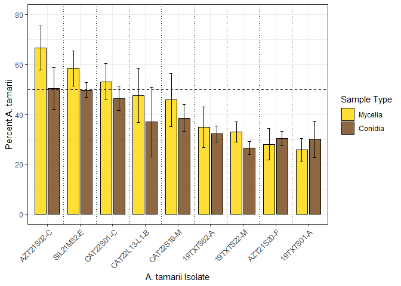<!-- -->

``` r
#some stats  - see below for new beta modelling

#fix names in maize_f_all for comparisons
#clean contrast names
maize_all_formodel<- maize_all

maize_all_formodel$Isolate1 <- maize_all$Isolate1 %>%
  gsub("-", "_", .)    # collapse  "-" to "_"


#clean contrast names
spores_all_formodel<- spores_all

spores_all_formodel$Isolate1 <- spores_all$Isolate1 %>%
  gsub("-", "_", .)    # collapse  "-" to "_"
```

New code for beta modelling of proportions

``` r
#prepare proportion data

maize_all_formodel$prop_tam <- (maize_all_formodel$percent_tam) / 100

model_beta_tm <- glmmTMB(
  prop_tam ~ Isolate1 + (1 | Dataset),
  data = maize_all_formodel,
  family = beta_family()
)

#generate data for Table S7
summary(model_beta_tm)
```

    ##  Family: beta  ( logit )
    ## Formula:          prop_tam ~ Isolate1 + (1 | Dataset)
    ## Data: maize_all_formodel
    ## 
    ##       AIC       BIC    logLik -2*log(L)  df.resid 
    ##     -18.8       3.1      20.4     -40.8        43 
    ## 
    ## Random effects:
    ## 
    ## Conditional model:
    ##  Groups  Name        Variance Std.Dev.
    ##  Dataset (Intercept) 0.0608   0.2466  
    ## Number of obs: 54, groups:  Dataset, 2
    ## 
    ## Dispersion parameter for beta family (): 6.67 
    ## 
    ## Conditional model:
    ##                       Estimate Std. Error z value Pr(>|z|)    
    ## (Intercept)            -0.9462     0.3624  -2.611 0.009024 ** 
    ## Isolate119TXTS22_M      0.3078     0.4414   0.697 0.485514    
    ## Isolate119TXTS62_A      0.1544     0.4409   0.350 0.726154    
    ## Isolate1AZT21S02_C      1.6226     0.4374   3.710 0.000208 ***
    ## Isolate1AZT21S20_F     -0.1296     0.4472  -0.290 0.771990    
    ## Isolate1CAT22L13_L1_B   0.8087     0.4469   1.809 0.070384 .  
    ## Isolate1CAT22S01_C      1.0582     0.4340   2.438 0.014752 *  
    ## Isolate1CAT22S16_M      0.7054     0.4292   1.643 0.100295    
    ## Isolate1SIL21M32_E      1.2639     0.4330   2.919 0.003511 ** 
    ## ---
    ## Signif. codes:  0 '***' 0.001 '**' 0.01 '*' 0.05 '.' 0.1 ' ' 1

``` r
r2(model_beta_tm)
```

    ## # R2 for Mixed Models
    ## 
    ##   Conditional R2: 0.711
    ##      Marginal R2: 0.600

``` r
emm_beta_tm <- emmeans(model_beta_tm, ~ Isolate1)
pairs_beta_tm <- contrast(emm_beta_tm, method = "pairwise")

# Get summary of pairwise comparisons
summary_tm <- summary(pairs_beta_tm)

##TEST
# Clean contrast names
summary_tm$contrast <- gsub(" ", "", summary_tm$contrast)

# Assign names and run multcompLetters
pvals_beta_tm <- summary_tm$p.value
names(pvals_beta_tm) <- summary_tm$contrast

letters_beta_tm <- multcompLetters(pvals_beta_tm)
print(letters_beta_tm$Letters)
```

    ##    19TXTS01_A    19TXTS22_M    19TXTS62_A    AZT21S02_C    AZT21S20_F 
    ##          "ab"         "abc"          "ab"           "c"           "a" 
    ## CAT22L13_L1_B    CAT22S01_C    CAT22S16_M    SIL21M32_E 
    ##         "abc"         "abc"         "abc"          "bc"

``` r
# Filter to the isolate
subset_data <- maize_all_formodel %>%
  filter(Isolate1 == "AZT21S02_C")

# Calculate mean and standard error
mean_val <- mean(subset_data$percent_tam, na.rm = TRUE)
se_val <- sd(subset_data$percent_tam, na.rm = TRUE) / sqrt(sum(!is.na(subset_data$percent_tam)))

# Print results
cat("Mean:", mean_val, "\n")
```

    ## Mean: 66.62476

``` r
cat("Standard Error:", se_val, "\n")
```

    ## Standard Error: 8.820997

``` r
#now do the same for conidia


spores_all_formodel$prop_tam <- (spores_all_formodel$percent_tam) / 100

model_beta_ts <- glmmTMB(
  prop_tam ~ Isolate1 + (1 | Dataset),
  data = spores_all_formodel,
  family = beta_family()
)

#generate data for Table S8
summary(model_beta_ts)
```

    ##  Family: beta  ( logit )
    ## Formula:          prop_tam ~ Isolate1 + (1 | Dataset)
    ## Data: spores_all_formodel
    ## 
    ##       AIC       BIC    logLik -2*log(L)  df.resid 
    ##     -30.8      -8.9      26.4     -52.8        43 
    ## 
    ## Random effects:
    ## 
    ## Conditional model:
    ##  Groups  Name        Variance  Std.Dev. 
    ##  Dataset (Intercept) 1.095e-10 1.047e-05
    ## Number of obs: 54, groups:  Dataset, 2
    ## 
    ## Dispersion parameter for beta family (): 8.72 
    ## 
    ## Conditional model:
    ##                       Estimate Std. Error z value Pr(>|z|)   
    ## (Intercept)           -0.86257    0.27947  -3.086  0.00203 **
    ## Isolate119TXTS22_M    -0.04641    0.39553  -0.117  0.90659   
    ## Isolate119TXTS62_A     0.18609    0.38945   0.478  0.63278   
    ## Isolate1AZT21S02_C     0.88264    0.38231   2.309  0.02096 * 
    ## Isolate1AZT21S20_F     0.11673    0.39107   0.298  0.76533   
    ## Isolate1CAT22L13_L1_B -0.00220    0.39424  -0.006  0.99555   
    ## Isolate1CAT22S01_C     0.72640    0.38244   1.899  0.05751 . 
    ## Isolate1CAT22S16_M     0.41422    0.38526   1.075  0.28230   
    ## Isolate1SIL21M32_E     0.85493    0.38227   2.236  0.02532 * 
    ## ---
    ## Signif. codes:  0 '***' 0.001 '**' 0.01 '*' 0.05 '.' 0.1 ' ' 1

``` r
r2(model_beta_ts)
```

    ## Warning: Can't compute random effect variances. Some variance components equal
    ##   zero. Your model may suffer from singularity (see `?lme4::isSingular`
    ##   and `?performance::check_singularity`).
    ##   Decrease the `tolerance` level to force the calculation of random effect
    ##   variances, or impose priors on your random effects parameters (using
    ##   packages like `brms` or `glmmTMB`).

    ## Random effect variances not available. Returned R2 does not account for random effects.

    ## # R2 for Mixed Models
    ## 
    ##   Conditional R2: NA
    ##      Marginal R2: 0.458

``` r
emm_beta_ts <- emmeans(model_beta_ts, ~ Isolate1)
pairs_beta_ts <- contrast(emm_beta_ts, method = "pairwise")


# Get summary of pairwise comparisons
summary_ts <- summary(pairs_beta_ts)

##TEST
# Clean contrast names
summary_ts$contrast <- gsub(" ", "", summary_ts$contrast)

# Assign names and run multcompLetters
pvals_beta_ts <- summary_ts$p.value
names(pvals_beta_ts) <- summary_ts$contrast

letters_beta_ts <- multcompLetters(pvals_beta_ts)
print(letters_beta_ts$Letters)
```

    ##    19TXTS01_A    19TXTS22_M    19TXTS62_A    AZT21S02_C    AZT21S20_F 
    ##           "a"           "a"           "a"           "a"           "a" 
    ## CAT22L13_L1_B    CAT22S01_C    CAT22S16_M    SIL21M32_E 
    ##           "a"           "a"           "a"           "a"

``` r
# Filter to the isolate
subset_data <- spores_all_formodel %>%
  filter(Isolate1 == "AZT21S02_C")

# Calculate mean and standard error
mean_val <- mean(subset_data$percent_tam, na.rm = TRUE)
se_val <- sd(subset_data$percent_tam, na.rm = TRUE) / sqrt(sum(!is.na(subset_data$percent_tam)))

# Print results
cat("Mean:", mean_val, "\n")
```

    ## Mean: 50.36793

``` r
cat("Standard Error:", se_val, "\n")
```

    ## Standard Error: 8.42649

REPEAT FOR flavus EXPERIMENT E,F,G

``` r
maizeE <- read.csv("./data_for_plots/ExpE_maize_results_wafla.csv")
maizeF <- read.csv("./data_for_plots/ExpF_maize_results_wafla.csv")
maizeG <- read.csv("./data_for_plots/ExpG_maize_results_wafla.csv")

sporesE <- read.csv("./data_for_plots/ExpE_spores_results.csv")
sporesF <- read.csv("./data_for_plots/ExpF_spores_results.csv")
sporesG <- read.csv("./data_for_plots/ExpG_spores_results.csv")

#filter to only the competition trials
maizeE_comp <- filter(maizeE, Isolate2=="AZT21S02-C" & Isolate1!="Water")
maizeF_comp <- filter(maizeF, Isolate2=="AZT21S02-C" & Isolate1!="Water")
maizeG_comp <- filter(maizeG, Isolate2=="AZT21S02-C" & Isolate1!="Water")

maizeE_comp$Dataset <- "E"
maizeF_comp$Dataset <- "F"
maizeG_comp$Dataset <- "G"

maize_f_all <- rbind(maizeE_comp, maizeF_comp, maizeG_comp)


#now for spores
sporesE_comp <- filter(sporesE, Isolate2=="AZT21S02-C" & Isolate1!="Water")
sporesF_comp <- filter(sporesF, Isolate2=="AZT21S02-C" & Isolate1!="Water")
sporesG_comp <- filter(sporesG, Isolate2=="AZT21S02-C" & Isolate1!="Water")

sporesE_comp$Dataset <- "E"
sporesF_comp$Dataset <- "F"
sporesG_comp$Dataset <- "G"

spores_f_all <- rbind(sporesE_comp, sporesF_comp, sporesG_comp)
```

Ok now for the plot

``` r
#let's start with a summary

maize_f_summary <- maize_f_all %>%
  group_by(Isolate1) %>%
  summarize(
    mean_percent = mean(percent_flav, na.rm = TRUE),
    se_percent   = sd(percent_flav, na.rm = TRUE) / sqrt(n()),
    .groups = "drop"
  )

spores_f_summary <- spores_f_all %>%
  group_by(Isolate1) %>%
  summarize(
    mean_percent = mean(percent_flav, na.rm = TRUE),
    se_percent   = sd(percent_flav, na.rm = TRUE) / sqrt(n()),
    .groups = "drop"
  )

maize_f_summary <- maize_f_summary %>%
  mutate(Type = "Mycelia")

spores_f_summary <- spores_f_summary %>%
  mutate(Type = "Conidia")

combined_f_summary <- bind_rows(maize_f_summary, spores_f_summary)

#fix order of mycelia / conidia
combined_f_summary$Type <- factor(combined_f_summary$Type, levels = c("Mycelia", "Conidia"))

#arrange by mycelia values
ordered_isolates <- maize_f_summary %>%
  arrange(desc(mean_percent)) %>%
  pull(Isolate1)

combined_f_summary$Isolate1 <- factor(combined_f_summary$Isolate1, levels = ordered_isolates)


#fix names for final plotting
combined_f_summary_fixname <- combined_f_summary %>%
  mutate(
    Isolate1 = recode(Isolate1,
                      "EB01" = "East Bernard-O",
                      "DV901" = "Danevang-3-K",
                      "V-MR17" = "30110-3508-C",
                      "BA12-J" = "BAJ12")
  )


####################
###NEW FIGURE 7#####

ggplot(combined_f_summary_fixname, aes(x = Isolate1, y = mean_percent, fill = Type)) +
  geom_col(position = position_dodge(width = 0.8), width = 0.7, color = "black", alpha = 0.8) +
  geom_errorbar(aes(ymin = mean_percent - se_percent,
                    ymax = mean_percent + se_percent),
                position = position_dodge(width = 0.8),
                width = 0.2, color = "black") +
  geom_hline(yintercept = 50, linetype = "dashed", color = "black") +
  geom_vline(xintercept = 1.5, color = "black", linetype = "dotted") +
  geom_vline(xintercept = 2.5, color = "black", linetype = "dotted") +
  geom_vline(xintercept = 3.5, color = "black", linetype = "dotted") +
  geom_vline(xintercept = 4.5, color = "black", linetype = "dotted") +
  geom_vline(xintercept = 5.5, color = "black", linetype = "dotted") +
  geom_vline(xintercept = 6.5, color = "black", linetype = "dotted") +
  geom_vline(xintercept = 7.5, color = "black", linetype = "dotted") +
  geom_vline(xintercept = 8.5, color = "black", linetype = "dotted") +
  xlab("A. flavus Isolate") +
  ylab("Percent A. flavus") +
  scale_y_continuous(limits = c(0, 80))+
  theme_bw() +
  theme(
    axis.text.x = element_text(angle = 45, hjust = 1),
    legend.position = "right"
  ) +
  scale_fill_manual(values = c("Mycelia" = "#FFD700", "Conidia" = "#4A5D23"),
                    name = "Sample Type")
```

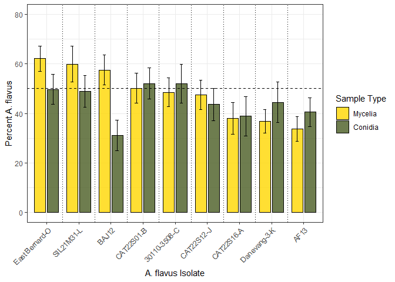<!-- -->

``` r
#fix names in maize_f_all for comparisons
#clean contrast names
maize_f_all_formodel<- maize_f_all

maize_f_all_formodel$Isolate1 <- maize_f_all$Isolate1 %>%
  gsub("-", "_", .)    # collapse  "-" to "_"


#and for conidia

#clean contrast names
spores_f_all_formodel<- spores_f_all

spores_f_all_formodel$Isolate1 <- spores_f_all$Isolate1 %>%
  gsub("-", "_", .)    # collapse  "-" to "_"
```

New code for beta model for proportions

``` r
#prepare proportion data

maize_f_all_formodel$prop_flav <- (maize_f_all_formodel$percent_flav) / 100

model_beta_fm <- glmmTMB(
  prop_flav ~ Isolate1 + (1 | Dataset),
  data = maize_f_all_formodel,
  family = beta_family()
)

#generate data for Table S9
summary(model_beta_fm)
```

    ##  Family: beta  ( logit )
    ## Formula:          prop_flav ~ Isolate1 + (1 | Dataset)
    ## Data: maize_f_all_formodel
    ## 
    ##       AIC       BIC    logLik -2*log(L)  df.resid 
    ##     -70.0     -43.7      46.0     -92.0        70 
    ## 
    ## Random effects:
    ## 
    ## Conditional model:
    ##  Groups  Name        Variance Std.Dev.
    ##  Dataset (Intercept) 0.1607   0.4009  
    ## Number of obs: 81, groups:  Dataset, 3
    ## 
    ## Dispersion parameter for beta family (): 12.1 
    ## 
    ## Conditional model:
    ##                    Estimate Std. Error z value Pr(>|z|)    
    ## (Intercept)         -0.6934     0.3045  -2.277 0.022784 *  
    ## Isolate1BA12_J       1.0097     0.2712   3.723 0.000197 ***
    ## Isolate1CAT22S01_B   0.6863     0.2716   2.527 0.011518 *  
    ## Isolate1CAT22S12_J   0.5869     0.2709   2.166 0.030274 *  
    ## Isolate1CAT22S16_A   0.1854     0.2790   0.665 0.506324    
    ## Isolate1DV901        0.1520     0.2750   0.553 0.580478    
    ## Isolate1EB01         1.2921     0.2823   4.576 4.73e-06 ***
    ## Isolate1SIL21M31_L   1.1190     0.2720   4.115 3.87e-05 ***
    ## Isolate1V_MR17       0.6400     0.2700   2.371 0.017758 *  
    ## ---
    ## Signif. codes:  0 '***' 0.001 '**' 0.01 '*' 0.05 '.' 0.1 ' ' 1

``` r
r2(model_beta_fm)
```

    ## # R2 for Mixed Models
    ## 
    ##   Conditional R2: 0.817
    ##      Marginal R2: 0.438

``` r
emm_beta_fm <- emmeans(model_beta_fm, ~ Isolate1)
pairs_beta_fm <- contrast(emm_beta_fm, method = "pairwise")
# Get summary of pairwise comparisons
summary_fm <- summary(pairs_beta_fm)

##TEST
# Clean contrast names
summary_fm$contrast <- gsub(" ", "", summary_fm$contrast)

# Assign names and run multcompLetters
pvals_beta_fm <- summary_fm$p.value
names(pvals_beta_fm) <- summary_fm$contrast

letters_beta_fm <- multcompLetters(pvals_beta_fm)
print(letters_beta_fm$Letters)
```

    ##       AF13     BA12_J CAT22S01_B CAT22S12_J CAT22S16_A      DV901       EB01 
    ##        "a"       "bc"      "abc"      "abc"       "ab"        "a"        "c" 
    ## SIL21M31_L     V_MR17 
    ##        "c"      "abc"

``` r
#now do the same for conidia


spores_f_all_formodel$prop_flav <- (spores_f_all_formodel$percent_flav) / 100

model_beta_fs <- glmmTMB(
  prop_flav ~ Isolate1 + (1 | Dataset),
  data = spores_f_all_formodel,
  family = beta_family()
)

#generate data for Table S10
summary(model_beta_fs)
```

    ##  Family: beta  ( logit )
    ## Formula:          prop_flav ~ Isolate1 + (1 | Dataset)
    ## Data: spores_f_all_formodel
    ## 
    ##       AIC       BIC    logLik -2*log(L)  df.resid 
    ##     -93.7     -67.3      57.8    -115.7        70 
    ## 
    ## Random effects:
    ## 
    ## Conditional model:
    ##  Groups  Name        Variance Std.Dev.
    ##  Dataset (Intercept) 0.516    0.7183  
    ## Number of obs: 81, groups:  Dataset, 3
    ## 
    ## Dispersion parameter for beta family (): 15.8 
    ## 
    ## Conditional model:
    ##                    Estimate Std. Error z value Pr(>|z|)  
    ## (Intercept)        -0.45615    0.45187  -1.010   0.3127  
    ## Isolate1BA12_J     -0.50262    0.25710  -1.955   0.0506 .
    ## Isolate1CAT22S01_B  0.53993    0.24928   2.166   0.0303 *
    ## Isolate1CAT22S12_J  0.11415    0.24776   0.461   0.6450  
    ## Isolate1CAT22S16_A -0.08987    0.24541  -0.366   0.7142  
    ## Isolate1DV901       0.17670    0.24321   0.727   0.4675  
    ## Isolate1EB01        0.43163    0.24977   1.728   0.0840 .
    ## Isolate1SIL21M31_L  0.39724    0.24886   1.596   0.1104  
    ## Isolate1V_MR17      0.59657    0.24606   2.425   0.0153 *
    ## ---
    ## Signif. codes:  0 '***' 0.001 '**' 0.01 '*' 0.05 '.' 0.1 ' ' 1

``` r
r2(model_beta_fs)
```

    ## # R2 for Mixed Models
    ## 
    ##   Conditional R2: 0.894
    ##      Marginal R2: 0.159

``` r
# Estimated marginal means
emm_beta_fs <- emmeans(model_beta_fs, ~ Isolate1)


pairs_beta_fs <- contrast(emm_beta_fs, method = "pairwise")

# Get summary of pairwise comparisons
summary_fs <- summary(pairs_beta_fs)

##TEST
# Clean contrast names
summary_fs$contrast <- gsub(" ", "", summary_fs$contrast)

# Assign names and run multcompLetters
pvals_beta_fs <- summary_fs$p.value
names(pvals_beta_fs) <- summary_fs$contrast

letters_beta_fs <- multcompLetters(pvals_beta_fs)
print(letters_beta_fs$Letters)
```

    ##       AF13     BA12_J CAT22S01_B CAT22S12_J CAT22S16_A      DV901       EB01 
    ##       "ab"        "a"        "b"       "ab"       "ab"       "ab"        "b" 
    ## SIL21M31_L     V_MR17 
    ##        "b"        "b"

T-test to see if isolates are significantly different that 50%

``` r
# Filter to the isolate
subset_data <- maize_all_formodel %>%
  filter(Isolate1 == "AZT21S20_F")

# Run one-sample t-test against 50%
t.test(subset_data$percent_tam, mu = 50)
```

    ## 
    ##  One Sample t-test
    ## 
    ## data:  subset_data$percent_tam
    ## t = -3.476, df = 5, p-value = 0.01773
    ## alternative hypothesis: true mean is not equal to 50
    ## 95 percent confidence interval:
    ##  11.74905 44.27224
    ## sample estimates:
    ## mean of x 
    ##  28.01064

``` r
# Run t-test for each isolate and tidy the output
#generate data for Table S11
maize_all_formodel %>%
  group_by(Isolate1) %>%
  summarise(t_test = list(t.test(percent_tam, mu = 50)), .groups = "drop") %>%
  mutate(tidy_out = map(t_test, tidy)) %>%
  unnest(tidy_out) %>%
  dplyr::select(Isolate1, estimate, statistic, p.value, conf.low, conf.high)
```

    ## # A tibble: 9 × 6
    ##   Isolate1      estimate statistic p.value conf.low conf.high
    ##   <chr>            <dbl>     <dbl>   <dbl>    <dbl>     <dbl>
    ## 1 19TXTS01_A        25.7    -5.36  0.00304     14.1      37.4
    ## 2 19TXTS22_M        33.0    -4.16  0.00882     22.5      43.5
    ## 3 19TXTS62_A        34.8    -1.88  0.119       14.0      55.6
    ## 4 AZT21S02_C        66.6     1.88  0.118       43.9      89.3
    ## 5 AZT21S20_F        28.0    -3.48  0.0177      11.7      44.3
    ## 6 CAT22L13_L1_B     47.6    -0.225 0.831       19.9      75.3
    ## 7 CAT22S01_C        53.1     0.422 0.691       34.3      71.8
    ## 8 CAT22S16_M        45.8    -0.396 0.708       18.4      73.1
    ## 9 SIL21M32_E        58.4     1.20  0.283       40.5      76.2

``` r
#generate data for Table S11
spores_all_formodel %>%
  group_by(Isolate1) %>%
  summarise(t_test = list(t.test(percent_tam, mu = 50)), .groups = "drop") %>%
  mutate(tidy_out = map(t_test, tidy)) %>%
  unnest(tidy_out) %>%
  dplyr::select(Isolate1, estimate, statistic, p.value, conf.low, conf.high)
```

    ## # A tibble: 9 × 6
    ##   Isolate1      estimate statistic  p.value conf.low conf.high
    ##   <chr>            <dbl>     <dbl>    <dbl>    <dbl>     <dbl>
    ## 1 19TXTS01_A        30.0   -2.79   0.0387      11.6       48.5
    ## 2 19TXTS22_M        26.5   -8.96   0.000289    19.8       33.3
    ## 3 19TXTS62_A        32.2   -5.47   0.00278     23.8       40.5
    ## 4 AZT21S02_C        50.4    0.0437 0.967       28.7       72.0
    ## 5 AZT21S20_F        30.4   -7.07   0.000875    23.2       37.5
    ## 6 CAT22L13_L1_B     36.9   -0.942  0.390        1.28      72.6
    ## 7 CAT22S01_C        46.4   -0.750  0.487       33.9       58.8
    ## 8 CAT22S16_M        38.5   -2.15   0.0841      24.7       52.2
    ## 9 SIL21M32_E        49.8   -0.0747 0.943       41.9       57.6

``` r
#and for flav
#generate data for Table S13
maize_f_all_formodel %>%
  group_by(Isolate1) %>%
  summarise(t_test = list(t.test(percent_flav, mu = 50)), .groups = "drop") %>%
  mutate(tidy_out = map(t_test, tidy)) %>%
  unnest(tidy_out) %>%
  dplyr::select(Isolate1, estimate, statistic, p.value, conf.low, conf.high)
```

    ## # A tibble: 9 × 6
    ##   Isolate1   estimate statistic p.value conf.low conf.high
    ##   <chr>         <dbl>     <dbl>   <dbl>    <dbl>     <dbl>
    ## 1 AF13           33.8   -3.28    0.0113     22.4      45.2
    ## 2 BA12_J         57.5    1.24    0.252      43.5      71.5
    ## 3 CAT22S01_B     50.2    0.0263  0.980      36.4      64.0
    ## 4 CAT22S12_J     47.5   -0.420   0.685      33.7      61.3
    ## 5 CAT22S16_A     38.0   -1.88    0.0966     23.2      52.7
    ## 6 DV901          36.8   -2.76    0.0249     25.7      47.8
    ## 7 EB01           62.1    2.39    0.0438     50.4      73.8
    ## 8 SIL21M31_L     59.9    1.36    0.211      43.1      76.6
    ## 9 V_MR17         48.5   -0.260   0.801      35.3      61.7

``` r
#generate data for Table S13
spores_f_all_formodel %>%
  group_by(Isolate1) %>%
  summarise(t_test = list(t.test(percent_flav, mu = 50)), .groups = "drop") %>%
  mutate(tidy_out = map(t_test, tidy)) %>%
  unnest(tidy_out) %>%
  dplyr::select(Isolate1, estimate, statistic, p.value, conf.low, conf.high)
```

    ## # A tibble: 9 × 6
    ##   Isolate1   estimate statistic p.value conf.low conf.high
    ##   <chr>         <dbl>     <dbl>   <dbl>    <dbl>     <dbl>
    ## 1 AF13           40.5   -1.63    0.143      27.1      54.0
    ## 2 BA12_J         31.1   -3.05    0.0158     16.9      45.4
    ## 3 CAT22S01_B     52.1    0.333   0.748      37.6      66.6
    ## 4 CAT22S12_J     43.6   -0.988   0.352      28.6      58.6
    ## 5 CAT22S16_A     38.9   -1.39    0.201      20.5      57.3
    ## 6 DV901          44.4   -0.679   0.516      25.6      63.3
    ## 7 EB01           49.7   -0.0512  0.960      35.8      63.6
    ## 8 SIL21M31_L     48.9   -0.169   0.870      34.2      63.7
    ## 9 V_MR17         52.0    0.248   0.810      33.8      70.1

Another T-test to see if proportions of each isolate are equal for
conidia/mycelia

``` r
#prep data
maize_all <- maize_all %>%
  mutate(Treatment = "Maize")

spores_all <- spores_all %>%
  mutate(Treatment = "Spores")

combined_df <- bind_rows(maize_all, spores_all)


maize_f_all <- maize_f_all %>%
  mutate(Treatment = "Maize")

spores_f_all <- spores_f_all %>%
  mutate(Treatment = "Spores")

combined_df_f <- bind_rows(maize_f_all, spores_f_all)

# Step 1: Reshape so each row has Maize and Spores values


wide_df <- combined_df %>%
  dplyr::select(Isolate1, Dataset, Rep, Treatment, percent_tam) %>%
  pivot_wider(names_from = Treatment, values_from = percent_tam)


# Step 2: Run paired t-tests by Dataset
#generate data for Table S12
wide_df %>%
  group_by(Isolate1) %>%
  summarise(
    t_test = list(t.test(Maize, Spores, paired = TRUE)),
    .groups = "drop"
  ) %>%
  mutate(tidy_out = map(t_test, tidy)) %>%
  unnest(tidy_out) %>%
  dplyr::select(Isolate1, estimate, statistic, p.value, conf.low, conf.high)
```

    ## # A tibble: 9 × 6
    ##   Isolate1      estimate statistic p.value conf.low conf.high
    ##   <chr>            <dbl>     <dbl>   <dbl>    <dbl>     <dbl>
    ## 1 19TXTS01-A       -4.28    -0.436 0.681    -29.5       21.0 
    ## 2 19TXTS22-M        6.48     1.18  0.290     -7.60      20.6 
    ## 3 19TXTS62-A        2.63     0.392 0.711    -14.6       19.9 
    ## 4 AZT21S02-C       16.3      4.06  0.00977    5.95      26.6 
    ## 5 AZT21S20-F       -2.36    -0.502 0.637    -14.5        9.73
    ## 6 CAT22L13-L1-B    10.6      2.50  0.0544    -0.297     21.6 
    ## 7 CAT22S01-C        6.71     0.952 0.385    -11.4       24.8 
    ## 8 CAT22S16-M        7.30     1.02  0.354    -11.1       25.7 
    ## 9 SIL21M32-E        8.59     1.38  0.226     -7.39      24.6

``` r
#and for flavus
# Step 1: Reshape so each row has Maize and Spores values
wide_df_f <- combined_df_f %>%
  dplyr::select(Isolate1, Dataset, Rep, Treatment, percent_flav) %>%
  pivot_wider(names_from = Treatment, values_from = percent_flav)


# Step 2: Run paired t-tests by Dataset
#generate data for Table S14
wide_df_f %>%
  group_by(Isolate1) %>%
  summarise(
    t_test = list(t.test(Maize, Spores, paired = TRUE)),
    .groups = "drop"
  ) %>%
  mutate(tidy_out = map(t_test, tidy)) %>%
  unnest(tidy_out) %>%
  dplyr::select(Isolate1, estimate, statistic, p.value, conf.low, conf.high)
```

    ## # A tibble: 9 × 6
    ##   Isolate1   estimate statistic p.value conf.low conf.high
    ##   <chr>         <dbl>     <dbl>   <dbl>    <dbl>     <dbl>
    ## 1 AF13         -6.77     -1.01   0.341   -22.2        8.64
    ## 2 BA12-J       26.4       3.32   0.0105    8.06      44.7 
    ## 3 CAT22S01-B   -1.93     -0.273  0.792   -18.3       14.4 
    ## 4 CAT22S12-J    3.90      0.709  0.498    -8.77      16.6 
    ## 5 CAT22S16-A   -0.909    -0.138  0.894   -16.1       14.3 
    ## 6 DV901        -7.65     -1.14   0.285   -23.1        7.76
    ## 7 EB01         12.4       2.20   0.0587   -0.579     25.4 
    ## 8 SIL21M31-L   10.9       1.77   0.115    -3.34      25.2 
    ## 9 V-MR17       -3.44     -0.583  0.576   -17.1       10.2

Now comparing the correlation between maize vs spores for both tamarii
and flavus.

``` r
#for tamarii

tam_raw_compare <- combined_df %>%
  dplyr::select(Isolate1, Vial., Dataset, Treatment, avg_tam) %>%
  pivot_wider(names_from = Treatment, values_from = avg_tam)


#fix names for final plotting
tam_raw_compare_fixname <- tam_raw_compare %>%
  mutate(
    Isolate1 = recode(Isolate1,
                      "AZSIL21M32-E" = "SIL21M32-E")
  )

#############################
####CODE FOR FIGURE 5(TOP)###
#############################

#now for one chart with dataset as Experiment
ggplot(tam_raw_compare_fixname,
       aes(x     = log(Maize),
           y     = log(Spores),
           fill = Isolate1,
           shape = Dataset)) +        # map Dataset to shape
  geom_abline(slope = 1,
              intercept = 0,
              linetype = "dashed",
              color = "gray50",
              linewidth=1.5) +
  geom_point(size = 4, alpha = 0.8, color="black") +
  geom_smooth(aes(x = log(Maize), y = log(Spores)), method = "lm", se = TRUE,
            color = "gray50", linewidth = 1.2, inherit.aes = FALSE)+
  scale_fill_colorblind(name = "Isolate") +
  scale_shape_manual(
    name   = "Experiment",
    values = c("A" = 21,    # circle
               "B" = 22,    # triangle
               "C" = 23)    # square
  ) +
  guides(
    fill = guide_legend(
      override.aes = list(
        shape  = 21,        # use a fill‐capable shape in the legend
        colour = "black",   # keep the black border
        size   = 4          # match your plot size
      )
    )
  ) +
  labs(
    x     = "log(A. tamarii mycelia copy number)",
    y     = "log(A. tamarii conidia copy number)",
    fill = "Isolate",
    shape = "Experiment"
  ) +
  theme_bw() +
  theme(
    axis.text.x = element_text(angle = 45, hjust = 1),
    legend.position = "right"
  )
```

    ## `geom_smooth()` using formula = 'y ~ x'

    ## Warning: This manual palette can handle a maximum of 8 values. You have
    ## supplied 9

<!-- -->

``` r
#get the info for the linear model in the figure
model <- lm(log(Spores) ~ log(Maize), data = tam_raw_compare_fixname)
summary(model)
```

    ## 
    ## Call:
    ## lm(formula = log(Spores) ~ log(Maize), data = tam_raw_compare_fixname)
    ## 
    ## Residuals:
    ##     Min      1Q  Median      3Q     Max 
    ## -2.4996 -0.2187  0.1143  0.3995  0.9584 
    ## 
    ## Coefficients:
    ##             Estimate Std. Error t value Pr(>|t|)    
    ## (Intercept)   5.2711     0.6086   8.661 1.17e-11 ***
    ## log(Maize)    0.1804     0.0591   3.053  0.00357 ** 
    ## ---
    ## Signif. codes:  0 '***' 0.001 '**' 0.01 '*' 0.05 '.' 0.1 ' ' 1
    ## 
    ## Residual standard error: 0.6346 on 52 degrees of freedom
    ## Multiple R-squared:  0.152,  Adjusted R-squared:  0.1357 
    ## F-statistic:  9.32 on 1 and 52 DF,  p-value: 0.003566

``` r
#see how many pts are above and below. 
# Get fitted values
fitted_vals <- fitted(model)

# Get observed values
observed_vals <- log(tam_raw_compare_fixname$Spores)

# Compare
above <- sum(observed_vals > fitted_vals)
below <- sum(observed_vals < fitted_vals)
equal <- sum(observed_vals == fitted_vals)  # optional

# Print results
cat("Points above the line:", above, "\n")
```

    ## Points above the line: 36

``` r
cat("Points below the line:", below, "\n")
```

    ## Points below the line: 18

``` r
#see how many outside the CI
# Get predicted values and 95% confidence intervals
pred <- predict(model, interval = "confidence")

# Get observed values
observed <- log(tam_raw_compare_fixname$Spores)

# Count how many are outside the confidence interval
outside <- sum(observed < pred[, "lwr"] | observed > pred[, "upr"])

# Print result
cat("Points outside the 95% confidence interval:", outside, "\n")
```

    ## Points outside the 95% confidence interval: 34

``` r
#look at experiments separately. 

tam_raw_compare_fixname %>%
  group_by(Dataset) %>%
  group_modify(~ tidy(lm(log(Spores) ~ log(Maize), data = .x)))
```

    ## # A tibble: 4 × 6
    ## # Groups:   Dataset [2]
    ##   Dataset term        estimate std.error statistic  p.value
    ##   <chr>   <chr>          <dbl>     <dbl>     <dbl>    <dbl>
    ## 1 B       (Intercept)    3.65      1.51      2.42  0.0229  
    ## 2 B       log(Maize)     0.360     0.166     2.16  0.0404  
    ## 3 C       (Intercept)    5.96      1.46      4.07  0.000413
    ## 4 C       log(Maize)     0.120     0.128     0.931 0.361

``` r
#for flavus

maize_f_all <- maize_f_all %>%
  mutate(Treatment = "Maize")

spores_f_all <- spores_f_all %>%
  mutate(Treatment = "Spores")

combined_df_f <- bind_rows(maize_f_all, spores_f_all)

flav_raw_compare <- combined_df_f %>%
  dplyr::select(Isolate1, Vial., Dataset, Treatment, avg_flav) %>%
  pivot_wider(names_from = Treatment, values_from = avg_flav)


#fix names for final plotting
flav_raw_compare_fixname <- flav_raw_compare %>%
  mutate(
    Isolate1 = recode(Isolate1,
                      "EB01" = "East Bernard-O",
                      "DV901" = "Danevang-3-K",
                      "V-MR17" = "30110-3508-C",
                      "BA12-J" = "BAJ12")
  )

#################################  
####CODE FOR FIGURE 5(BOTTOM)####
#################################


#also fixes legend order
ggplot(flav_raw_compare_fixname,
       aes(x     = log(Maize),
           y     = log(Spores),
           fill = Isolate1,
           shape = Dataset)) +        # map Dataset to shape
  geom_abline(slope = 1,
              intercept = 0,
              linetype = "dashed",
              color = "gray50",
              linewidth=1.5) +
  geom_point(size = 4, alpha = 0.8, color="black") +
  geom_smooth(aes(x = log(Maize), y = log(Spores)), method = "lm", se = TRUE,
            color = "gray50", linewidth = 1.2, inherit.aes = FALSE)+
  scale_fill_colorblind(name = "Isolate") +
  scale_shape_manual(
    name   = "Experiment",
    values = c("E" = 21,    # circle
               "F" = 22,    # triangle
               "G" = 23)    # square
  ) +
  guides(
    fill = guide_legend(
      override.aes = list(
        shape  = 21,        # use a fill‐capable shape in the legend
        colour = "black",   # keep the black border
        size   = 4          # match your plot size
      ),
      order = 1             # Isolate legend first
    ),
    shape = guide_legend(order = 2)  # Experiment legend second
  ) +
  labs(
    x     = "log(A. flavus mycelia copy number)",
    y     = "log(A. flavus conidia copy number)",
    fill = "Isolate",
    shape = "Experiment"
  ) +
  theme_bw() +
  theme(
    axis.text.x = element_text(angle = 45, hjust = 1),
    legend.position = "right"
  )
```

    ## `geom_smooth()` using formula = 'y ~ x'

    ## Warning: This manual palette can handle a maximum of 8 values. You have
    ## supplied 9

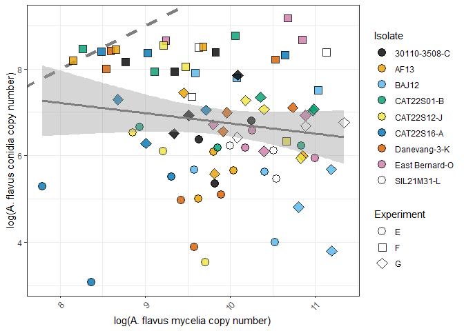<!-- -->

``` r
#get info for lm in the figure

model_f <- lm(log(Spores) ~ log(Maize), data = flav_raw_compare_fixname)
summary(model_f)
```

    ## 
    ## Call:
    ## lm(formula = log(Spores) ~ log(Maize), data = flav_raw_compare_fixname)
    ## 
    ## Residuals:
    ##     Min      1Q  Median      3Q     Max 
    ## -4.0640 -0.6990  0.1069  1.0644  2.5877 
    ## 
    ## Coefficients:
    ##             Estimate Std. Error t value Pr(>|t|)    
    ## (Intercept)   9.1069     1.8247   4.991  3.5e-06 ***
    ## log(Maize)   -0.2361     0.1841  -1.282    0.203    
    ## ---
    ## Signif. codes:  0 '***' 0.001 '**' 0.01 '*' 0.05 '.' 0.1 ' ' 1
    ## 
    ## Residual standard error: 1.353 on 79 degrees of freedom
    ## Multiple R-squared:  0.02039,    Adjusted R-squared:  0.007991 
    ## F-statistic: 1.644 on 1 and 79 DF,  p-value: 0.2035

``` r
#see how many pts are above and below. 
# Get fitted values
fitted_vals_f <- fitted(model_f)

# Get observed values
observed_vals_f <- log(flav_raw_compare_fixname$Spores)

# Compare
above <- sum(observed_vals_f > fitted_vals_f)
below <- sum(observed_vals_f < fitted_vals_f)
equal <- sum(observed_vals_f == fitted_vals_f)  # optional

# Print results
cat("Points above the line:", above, "\n")
```

    ## Points above the line: 42

``` r
cat("Points below the line:", below, "\n")
```

    ## Points below the line: 39

``` r
#see how many outside the CI
# Get predicted values and 95% confidence intervals
pred_f <- predict(model_f, interval = "confidence")

# Get observed values
observed_f <- log(flav_raw_compare_fixname$Spores)

# Count how many are outside the confidence interval
outside_f <- sum(observed_f < pred_f[, "lwr"] | observed_f > pred_f[, "upr"])

# Print result
cat("Points outside the 95% confidence interval:", outside, "\n")
```

    ## Points outside the 95% confidence interval: 34

``` r
#look at experiments separately. 

flav_raw_compare_fixname %>%
  group_by(Dataset) %>%
  group_modify(~ tidy(lm(log(Spores) ~ log(Maize), data = .x)))
```

    ## # A tibble: 6 × 6
    ## # Groups:   Dataset [3]
    ##   Dataset term        estimate std.error statistic      p.value
    ##   <chr>   <chr>          <dbl>     <dbl>     <dbl>        <dbl>
    ## 1 E       (Intercept)   2.38       2.55      0.935 0.359       
    ## 2 E       log(Maize)    0.325      0.260     1.25  0.223       
    ## 3 F       (Intercept)   8.97       1.15      7.78  0.0000000390
    ## 4 F       log(Maize)   -0.0803     0.120    -0.670 0.509       
    ## 5 G       (Intercept)  10.9        2.36      4.62  0.0000998   
    ## 6 G       log(Maize)   -0.422      0.229    -1.84  0.0776

Now to quantify overall reduction in tamarii and flavus due to
competition.

``` r
#add variable for experiment and sample type
maizeB <- maizeB %>% mutate(Experiment = "B")
maizeC <- maizeC %>% mutate(Experiment = "C")
maizeB <- maizeB %>% mutate(SampleType = "maize")
maizeC <- maizeC %>% mutate(SampleType = "maize")

maizeE <- maizeE %>% mutate(Experiment = "E")
maizeF <- maizeF %>% mutate(Experiment = "F")
maizeG <- maizeG %>% mutate(Experiment = "G")
maizeE <- maizeE %>% mutate(SampleType = "maize")
maizeF <- maizeF %>% mutate(SampleType = "maize")
maizeG <- maizeG %>% mutate(SampleType = "maize")

sporesB <- sporesB %>% mutate(Experiment = "B")
sporesC <- sporesC %>% mutate(Experiment = "C")
sporesB <- sporesB %>% mutate(SampleType = "spores")
sporesC <- sporesC %>% mutate(SampleType = "spores")

sporesE <- sporesE %>% mutate(Experiment = "E")
sporesF <- sporesF %>% mutate(Experiment = "F")
sporesG <- sporesG %>% mutate(Experiment = "G")
sporesE <- sporesE %>% mutate(SampleType = "spores")
sporesF <- sporesF %>% mutate(SampleType = "spores")
sporesG <- sporesG %>% mutate(SampleType = "spores")

#combine
data_all_t <- bind_rows(
  maizeB, maizeC,
  sporesB, sporesC,
)

data_all_f <- bind_rows(
  maizeE, maizeF, maizeG,
  sporesE, sporesF, sporesG
)

#tag single and co-inoculated
data_all_t <- data_all_t %>%
  mutate(
    Treatment = case_when(
      Isolate1 == "Water" & Isolate2 == "Water" ~ "control",
      Isolate1 != "Water" & Isolate2 == "Water" ~ "singly-inoculated",
      Isolate1 == "Water" & Isolate2 != "Water" ~ "singly-inoculated",
      Isolate1 != "Water" & Isolate2 != "Water" ~ "co-inoculated",
      TRUE ~ NA_character_
    )
  )


data_all_f <- data_all_f %>%
  mutate(
    Treatment = case_when(
      Isolate1 == "Water" & Isolate2 == "Water" ~ "control",
      Isolate1 != "Water" & Isolate2 == "Water" ~ "singly-inoculated",
      Isolate1 == "Water" & Isolate2 != "Water" ~ "singly-inoculated",
      Isolate1 != "Water" & Isolate2 != "Water" ~ "co-inoculated",
      TRUE ~ NA_character_
    )
  )

#select subsets based on treatment
tam_solo_m <- filter(data_all_t, Treatment == "singly-inoculated", SampleType=="maize")

tam_solo_s <- filter(data_all_t, Treatment == "singly-inoculated", SampleType=="spores")

flav_solo_m <- filter(data_all_f, Treatment == "singly-inoculated", SampleType=="maize")

flav_solo_s <- filter(data_all_f, Treatment == "singly-inoculated", SampleType=="spores")

tam_co_m <- filter(data_all_t, Treatment == "co-inoculated", SampleType=="maize")

tam_co_s <- filter(data_all_t, Treatment == "co-inoculated", SampleType=="spores")

flav_co_m <- filter(data_all_f, Treatment == "co-inoculated", SampleType=="maize")

flav_co_s <- filter(data_all_f, Treatment == "co-inoculated", SampleType=="spores")


#summary mean copy numbers by isolate and experiment

tam_solo_m_summary <- tam_solo_m %>%
  group_by(Isolate1, Experiment) %>%
  summarize(mean_solo_tam = mean(avg_tam, na.rm = TRUE), .groups = "drop")


tam_solo_s_summary <- tam_solo_s %>%
  group_by(Isolate1, Experiment) %>%
  summarize(mean_solo_tam = mean(avg_tam, na.rm = TRUE), .groups = "drop")


flav_solo_m_summary <- flav_solo_m %>%
  group_by(Isolate1, Experiment) %>%
  summarize(mean_solo_flav = mean(avg_flav, na.rm = TRUE), .groups = "drop")


flav_solo_s_summary <- flav_solo_s %>%
  group_by(Isolate1, Experiment) %>%
  summarize(mean_solo_flav = mean(avg_flav, na.rm = TRUE), .groups = "drop")


#calculate avg_flav and avg_tam 
tam_co_m_summary <- tam_co_m %>%
  group_by(Isolate1, Experiment) %>%
  summarize(mean_co_flav = mean(avg_flav, na.rm = TRUE),
            mean_co_tam = mean(avg_tam, na.rm = TRUE),  .groups = "drop")

#drop controls
tam_co_m_summary <- filter(tam_co_m_summary, Isolate1 != "Water")


#calculate for avg_tam and avg_flav
tam_co_s_summary <- tam_co_s %>%
  group_by(Isolate1, Experiment) %>%
  summarize(mean_co_flav = mean(avg_flav, na.rm = TRUE),
            mean_co_tam = mean(avg_tam, na.rm = TRUE), .groups = "drop")

#drop controls
tam_co_s_summary <- filter(tam_co_s_summary, Isolate1 != "Water")


flav_co_m_summary <- flav_co_m %>%
  group_by(Isolate1, Experiment) %>%
  summarize(mean_co_flav = mean(avg_flav, na.rm = TRUE),
            mean_co_tam = mean(avg_tam, na.rm = TRUE),    .groups = "drop")

#drop controls
flav_co_m_summary <- filter(flav_co_m_summary, Isolate1 != "Water")


flav_co_s_summary <- flav_co_s %>%
  group_by(Isolate1, Experiment) %>%
  summarize(mean_co_flav = mean(avg_flav, na.rm = TRUE),
            mean_co_tam = mean(avg_tam, na.rm = TRUE),.groups = "drop")

#drop controls
flav_co_s_summary <- filter(flav_co_s_summary, Isolate1 != "Water")


#ok now to compare the average values 

#FOR TAMARII
#maize
tam_suppression_m <- left_join(
  tam_solo_m_summary, tam_co_m_summary,
  by = c("Isolate1", "Experiment")
)

#drop controls
tam_suppression_m <- filter(tam_suppression_m, Isolate1 != "Water")
#27


##CALCULATION OF SUPPRESSION
##CHANGING TO PERCENT SUPRESSION 8/11/25
#old
#tam_suppression_m <- tam_suppression_m %>%
#  mutate(reduction = 1 - (mean_co / mean_solo))


#######################
######FIGURE 2 TOPL####


#MAKE FINAL PLOT FOR TAM SUPPRESSION
ggplot(tam_suppression_m, 
       aes(x     = log(mean_solo_tam),
           y     = log(mean_co_tam),
           shape = Experiment,    # ← map Experiment to shape
           fill = Isolate1)) + # ← optional: keep color if you like
  geom_abline(slope    = 1, 
              intercept= 0, 
              linetype = "dashed", 
              color    = "gray50",
              linewidth = 1.5) +
  geom_point(size = 4, alpha = 0.8, color="black") +
  
  # you can pick your own shapes, e.g. circle, triangle, square…
  scale_shape_manual(
    name   = "Experiment",
    values = c("B" = 22,  
               "C" = 23) 
  ) +
  
  # if you want matching color palette
  scale_fill_colorblind(name = "Isolate") +
  theme_minimal()+
  guides(
    fill = guide_legend(
      override.aes = list(
        shape  = 21,        # use a fill‐capable shape in the legend
        colour = "black",   # keep the black border
        size   = 4          # match your plot size
      )
    )
  ) +
  labs(
    x = "Log(Solo Copy Number)",
    y = "Log(Co-inoculated Copy Number)"
  ) +
  geom_smooth(aes(x = log(mean_solo_tam), y = log(mean_co_tam)), method = "lm", se = TRUE,
            color = "gray50", linewidth = 1.2, inherit.aes = FALSE)+
  theme(
    legend.position = "right"
  )
```

    ## `geom_smooth()` using formula = 'y ~ x'

    ## Warning: This manual palette can handle a maximum of 8 values. You have
    ## supplied 9

<!-- -->

``` r
#get info for lm
summary(lm(log(mean_co_tam) ~ log(mean_solo_tam), data=tam_suppression_m))
```

    ## 
    ## Call:
    ## lm(formula = log(mean_co_tam) ~ log(mean_solo_tam), data = tam_suppression_m)
    ## 
    ## Residuals:
    ##      Min       1Q   Median       3Q      Max 
    ## -0.96760 -0.26014  0.04081  0.20309  0.82204 
    ## 
    ## Coefficients:
    ##                    Estimate Std. Error t value Pr(>|t|)    
    ## (Intercept)         -2.5157     1.1991  -2.098   0.0521 .  
    ## log(mean_solo_tam)   1.1591     0.1075  10.782 9.54e-09 ***
    ## ---
    ## Signif. codes:  0 '***' 0.001 '**' 0.01 '*' 0.05 '.' 0.1 ' ' 1
    ## 
    ## Residual standard error: 0.5072 on 16 degrees of freedom
    ## Multiple R-squared:  0.879,  Adjusted R-squared:  0.8715 
    ## F-statistic: 116.3 on 1 and 16 DF,  p-value: 9.54e-09

``` r
#is the slope significantly different than 1?


#t-test for significance

t.test(log(tam_suppression_m$mean_co_tam), log(tam_suppression_m$mean_solo_tam), paired = TRUE)
```

    ## 
    ##  Paired t-test
    ## 
    ## data:  log(tam_suppression_m$mean_co_tam) and log(tam_suppression_m$mean_solo_tam)
    ## t = -6.0664, df = 17, p-value = 1.258e-05
    ## alternative hypothesis: true mean difference is not equal to 0
    ## 95 percent confidence interval:
    ##  -1.0110647 -0.4892686
    ## sample estimates:
    ## mean difference 
    ##      -0.7501666

``` r
#spores
tam_suppression_s <- left_join(
  tam_solo_s_summary, tam_co_s_summary,
  by = c("Isolate1", "Experiment")
)


#drop controls
tam_suppression_s <- filter(tam_suppression_s, Isolate1 != "Water")


##################
##FIGURE 2 TOP R##

#PLOT FOR SPORES
ggplot(tam_suppression_s, 
       aes(x     = log(mean_solo_tam),
           y     = log(mean_co_tam),
           shape = Experiment,    # ← map Experiment to shape
           fill = Isolate1)) + # ← optional: keep color if you like
  geom_abline(slope    = 1, 
              intercept= 0, 
              linetype = "dashed", 
              color    = "gray50",
              linewidth = 1.5) +
  geom_smooth(aes(x = log(mean_solo_tam), y = log(mean_co_tam)), method = "lm", se = TRUE,
            color = "gray50", linewidth = 1.2, inherit.aes = FALSE)+
  geom_point(size = 4, alpha = 0.8, color="black") +
  
  # you can pick your own shapes, e.g. circle, triangle, square…
  scale_shape_manual(
    name   = "Experiment",
    values = c("B" = 22,  
               "C" = 23) 
  ) +
  
  # if you want matching color palette
  scale_fill_colorblind(name = "Isolate") +
  theme_minimal()+
  guides(
    fill = guide_legend(
      override.aes = list(
        shape  = 21,        # use a fill‐capable shape in the legend
        colour = "black",   # keep the black border
        size   = 4          # match your plot size
      )
    )
  ) +
  labs(
    x = "Log(Solo Copy Number)",
    y = "Log(Co-inoculated Copy Number)"
  ) +
  theme(
    legend.position = "right"
  )
```

    ## `geom_smooth()` using formula = 'y ~ x'

    ## Warning: This manual palette can handle a maximum of 8 values. You have
    ## supplied 9

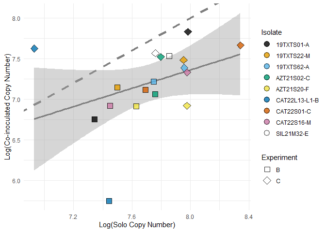<!-- -->

``` r
#get info for lm
summary(lm(log(mean_co_tam) ~ log(mean_solo_tam), data=tam_suppression_s))
```

    ## 
    ## Call:
    ## lm(formula = log(mean_co_tam) ~ log(mean_solo_tam), data = tam_suppression_s)
    ## 
    ## Residuals:
    ##      Min       1Q   Median       3Q      Max 
    ## -1.30033 -0.15450  0.02345  0.22568  0.86596 
    ## 
    ## Coefficients:
    ##                    Estimate Std. Error t value Pr(>|t|)
    ## (Intercept)          2.8433     2.6982   1.054    0.308
    ## log(mean_solo_tam)   0.5647     0.3489   1.618    0.125
    ## 
    ## Residual standard error: 0.4549 on 16 degrees of freedom
    ## Multiple R-squared:  0.1407, Adjusted R-squared:  0.08697 
    ## F-statistic: 2.619 on 1 and 16 DF,  p-value: 0.1251

``` r
#t-test for significance 

t.test(log(tam_suppression_s$mean_co_tam), log(tam_suppression_s$mean_solo_tam), paired = TRUE)
```

    ## 
    ##  Paired t-test
    ## 
    ## data:  log(tam_suppression_s$mean_co_tam) and log(tam_suppression_s$mean_solo_tam)
    ## t = -4.7793, df = 17, p-value = 0.0001743
    ## alternative hypothesis: true mean difference is not equal to 0
    ## 95 percent confidence interval:
    ##  -0.7506429 -0.2908674
    ## sample estimates:
    ## mean difference 
    ##      -0.5207551

Now we do the same for flavus

``` r
#maize
flav_suppression_m <- left_join(
  flav_solo_m_summary, flav_co_m_summary,
  by = c("Isolate1", "Experiment")
)

#spores

flav_suppression_s <- left_join(
  flav_solo_s_summary, flav_co_s_summary,
  by = c("Isolate1", "Experiment")
)


#MAKE FINAL PLOT FOR flav SUPPRESSION
#rename
flav_suppression_m_fixname <- flav_suppression_m %>%
  mutate(
    Isolate1 = recode(Isolate1,
                      "EB01" = "East Bernard-O",
                      "DV901" = "Danevang-3-K",
                      "V-MR17" = "30110-3508-C",
                      "BA12-J" = "BAJ12")
  )

##############################
###FIGURE 2 BOTTOM L###########

ggplot(flav_suppression_m_fixname, 
       aes(x     = log(mean_solo_flav),
           y     = log(mean_co_flav),
           shape = Experiment,    # ← map Experiment to shape
           fill = Isolate1)) + # ← optional: keep color if you like
  geom_abline(slope    = 1, 
              intercept= 0, 
              linetype = "dashed", 
              color    = "gray50",
              linewidth = 1.5) +
  geom_point(size = 4, alpha = 0.8, color="black") +
  geom_smooth(aes(x = log(mean_solo_flav), y = log(mean_co_flav)), method = "lm", se = TRUE,
            color = "gray50", linewidth = 1.2, inherit.aes = FALSE)+
  # you can pick your own shapes, e.g. circle, triangle, square…
  scale_shape_manual(
    name   = "Experiment",
    values = c("E" = 21,  
               "F" = 22,  
               "G" = 23) 
  ) +
  
  # if you want matching color palette
  scale_fill_colorblind(name = "Isolate") +
  theme_minimal()+
  guides(
    fill = guide_legend(
      override.aes = list(
        shape  = 21,        # use a fill‐capable shape in the legend
        colour = "black",   # keep the black border
        size   = 4          # match your plot size
      )
    )
  ) +
  labs(
    x = "Log(Solo Copy Number)",
    y = "Log(Co-inoculated Copy Number)"
  ) +
  theme(
    legend.position = "right"
  )
```

    ## `geom_smooth()` using formula = 'y ~ x'

    ## Warning: Removed 3 rows containing non-finite outside the scale range
    ## (`stat_smooth()`).

    ## Warning: This manual palette can handle a maximum of 8 values. You have
    ## supplied 10

    ## Warning: Removed 3 rows containing missing values or values outside the scale range
    ## (`geom_point()`).

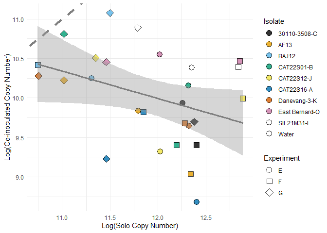<!-- -->

``` r
#get info for lm
summary(lm(log(mean_co_flav) ~ log(mean_solo_flav), data=flav_suppression_m))
```

    ## 
    ## Call:
    ## lm(formula = log(mean_co_flav) ~ log(mean_solo_flav), data = flav_suppression_m)
    ## 
    ## Residuals:
    ##      Min       1Q   Median       3Q      Max 
    ## -1.16801 -0.23042 -0.01158  0.39155  0.90889 
    ## 
    ## Coefficients:
    ##                     Estimate Std. Error t value Pr(>|t|)    
    ## (Intercept)          14.1661     2.1079   6.721 4.82e-07 ***
    ## log(mean_solo_flav)  -0.3478     0.1766  -1.970   0.0601 .  
    ## ---
    ## Signif. codes:  0 '***' 0.001 '**' 0.01 '*' 0.05 '.' 0.1 ' ' 1
    ## 
    ## Residual standard error: 0.5602 on 25 degrees of freedom
    ##   (3 observations deleted due to missingness)
    ## Multiple R-squared:  0.1343, Adjusted R-squared:  0.0997 
    ## F-statistic: 3.879 on 1 and 25 DF,  p-value: 0.06006

``` r
#t-test for significance

t.test(log(flav_suppression_m$mean_co_flav), log(flav_suppression_m$mean_solo_flav), paired = TRUE)
```

    ## 
    ##  Paired t-test
    ## 
    ## data:  log(flav_suppression_m$mean_co_flav) and log(flav_suppression_m$mean_solo_flav)
    ## t = -9.8653, df = 26, p-value = 2.81e-10
    ## alternative hypothesis: true mean difference is not equal to 0
    ## 95 percent confidence interval:
    ##  -2.299937 -1.506770
    ## sample estimates:
    ## mean difference 
    ##       -1.903353

``` r
#now for spores

#MAKE FINAL PLOT FOR flav SUPPRESSION
#rename
flav_suppression_s_fixname <- flav_suppression_s %>%
  mutate(
    Isolate1 = recode(Isolate1,
                      "EB01" = "East Bernard-O",
                      "DV901" = "Danevang-3-K",
                      "V-MR17" = "30110-3508-C",
                      "BA12-J" = "BAJ12")
  )

##################################
#####FIGURE 2 BOTTOMR############

ggplot(flav_suppression_s_fixname, 
       aes(x     = log(mean_solo_flav),
           y     = log(mean_co_flav),
           shape = Experiment,    # ← map Experiment to shape
           fill = Isolate1)) + # ← optional: keep color if you like
  geom_abline(slope    = 1, 
              intercept= 0, 
              linetype = "dashed", 
              color    = "gray50",
              linewidth = 1.5) +
  geom_point(size = 4, alpha = 0.8, color="black") +
  geom_smooth(aes(x = log(mean_solo_flav), y = log(mean_co_flav)), method = "lm", se = TRUE,
            color = "gray50", linewidth = 1.2, inherit.aes = FALSE)+
  # you can pick your own shapes, e.g. circle, triangle, square…
  scale_shape_manual(
    name   = "Experiment",
    values = c("E" = 21,  
               "F" = 22,  
               "G" = 23) 
  ) +
  
  # if you want matching color palette
  scale_fill_colorblind(name = "Isolate") +
  theme_minimal()+
  guides(
    fill = guide_legend(
      override.aes = list(
        shape  = 21,        # use a fill‐capable shape in the legend
        colour = "black",   # keep the black border
        size   = 4          # match your plot size
      )
    )
  ) +
  labs(
    x = "Log(Solo Copy Number)",
    y = "Log(Co-inoculated Copy Number)"
  ) +
  theme(
    legend.position = "right"
  )
```

    ## `geom_smooth()` using formula = 'y ~ x'

    ## Warning: Removed 3 rows containing non-finite outside the scale range
    ## (`stat_smooth()`).

    ## Warning: This manual palette can handle a maximum of 8 values. You have
    ## supplied 10

    ## Warning: Removed 3 rows containing missing values or values outside the scale range
    ## (`geom_point()`).

<!-- -->

``` r
#get info for lm
summary(lm(log(mean_co_flav) ~ log(mean_solo_flav), data=flav_suppression_s))
```

    ## 
    ## Call:
    ## lm(formula = log(mean_co_flav) ~ log(mean_solo_flav), data = flav_suppression_s)
    ## 
    ## Residuals:
    ##     Min      1Q  Median      3Q     Max 
    ## -1.5503 -0.2795  0.1875  0.4114  1.3945 
    ## 
    ## Coefficients:
    ##                     Estimate Std. Error t value Pr(>|t|)    
    ## (Intercept)          1.95159    0.67731   2.881  0.00801 ** 
    ## log(mean_solo_flav)  0.64861    0.08712   7.445 8.49e-08 ***
    ## ---
    ## Signif. codes:  0 '***' 0.001 '**' 0.01 '*' 0.05 '.' 0.1 ' ' 1
    ## 
    ## Residual standard error: 0.6699 on 25 degrees of freedom
    ##   (3 observations deleted due to missingness)
    ## Multiple R-squared:  0.6892, Adjusted R-squared:  0.6767 
    ## F-statistic: 55.43 on 1 and 25 DF,  p-value: 8.49e-08

``` r
#t-test for significance
t.test(log(flav_suppression_s$mean_co_flav), log(flav_suppression_s$mean_solo_flav), paired = TRUE)
```

    ## 
    ##  Paired t-test
    ## 
    ## data:  log(flav_suppression_s$mean_co_flav) and log(flav_suppression_s$mean_solo_flav)
    ## t = -4.4964, df = 26, p-value = 0.000127
    ## alternative hypothesis: true mean difference is not equal to 0
    ## 95 percent confidence interval:
    ##  -1.0642117 -0.3964682
    ## sample estimates:
    ## mean difference 
    ##      -0.7303399

plots and stats to see if suppression differs by isolates

``` r
#first calculate reduction and ratio
tam_suppression_m <- tam_suppression_m %>%
  mutate(reduction = (log(mean_solo_tam) - log(mean_co_tam)))

tam_suppression_m <- tam_suppression_m %>%
  mutate(reduction_ratio = (mean_co_tam / mean_solo_tam))

tam_suppression_s <- tam_suppression_s %>%
  mutate(reduction = (log(mean_solo_tam) - log(mean_co_tam)))

tam_suppression_s <- tam_suppression_s %>%
  mutate(reduction_ratio = (mean_co_tam / mean_solo_tam))

reduction_summary_tm <- tam_suppression_m %>%
  group_by(Isolate1) %>%
  summarize(
    mean_reduction = mean(reduction_ratio, na.rm = TRUE),
    se_reduction   = sd(reduction_ratio, na.rm = TRUE) / sqrt(n()),
    .groups = "drop"
  )%>%
  mutate(Type = "mycelia")

reduction_summary_ts <- tam_suppression_s %>%
  group_by(Isolate1) %>%
  summarize(
    mean_reduction = mean(reduction_ratio, na.rm = TRUE),
    se_reduction   = sd(reduction_ratio, na.rm = TRUE) / sqrt(n()),
    .groups = "drop"
  ) %>%
  mutate(Type = "conidia")

reduction_combined <- bind_rows(reduction_summary_tm, reduction_summary_ts)


#reorder for combined
reduction_combined$Type <- factor(reduction_combined$Type, levels = c("mycelia", "conidia"))


##LETS TRY SUPPRESSION INSTEAD OF REDUCTION
#first calculate reduction
#new
tam_suppression_m <- tam_suppression_m %>%
  mutate(suppression = (1 - (mean_co_tam/ mean_solo_tam)) *100)

tam_suppression_s <- tam_suppression_s %>%
  mutate(suppression = (1 - (mean_co_tam/ mean_solo_tam)) *100)

suppression_summary_tm <- tam_suppression_m %>%
  group_by(Isolate1) %>%
  summarize(
    mean_suppression = mean(suppression, na.rm = TRUE),
    se_suppression   = sd(suppression, na.rm = TRUE) / sqrt(n()),
    .groups = "drop"
  )%>%
  mutate(Type = "mycelia")

suppression_summary_ts <- tam_suppression_s %>%
  group_by(Isolate1) %>%
  summarize(
    mean_suppression = mean(suppression, na.rm = TRUE),
    se_suppression   = sd(suppression, na.rm = TRUE) / sqrt(n()),
    .groups = "drop"
  ) %>%
  mutate(Type = "conidia")

suppression_combined <- bind_rows(suppression_summary_tm, suppression_summary_ts)


#reorder for combined
suppression_combined$Type <- factor(suppression_combined$Type, levels = c("mycelia", "conidia"))
```

Now the same for flavus suppression

``` r
#first calculate reduction
#new
flav_suppression_m <- flav_suppression_m %>%
  mutate(reduction = (log(mean_solo_flav) - log(mean_co_flav)))

flav_suppression_m <- flav_suppression_m %>%
  mutate(reduction_ratio = (mean_co_flav / mean_solo_flav))

flav_suppression_s <- flav_suppression_s %>%
  mutate(reduction = (log(mean_solo_flav) - log(mean_co_flav)))

flav_suppression_s <- flav_suppression_s %>%
  mutate(reduction_ratio = (mean_co_flav / mean_solo_flav))

reduction_summary_tm <- tam_suppression_m %>%
  group_by(Isolate1) %>%
  summarize(
    mean_reduction = mean(reduction_ratio, na.rm = TRUE),
    se_reduction   = sd(reduction_ratio, na.rm = TRUE) / sqrt(n()),
    .groups = "drop"
  )%>%
  mutate(Type = "mycelia")

reduction_summary_ts <- tam_suppression_s %>%
  group_by(Isolate1) %>%
  summarize(
    mean_reduction = mean(reduction_ratio, na.rm = TRUE),
    se_reduction   = sd(reduction_ratio, na.rm = TRUE) / sqrt(n()),
    .groups = "drop"
  ) %>%
  mutate(Type = "conidia")

reduction_combined <- bind_rows(reduction_summary_tm, reduction_summary_ts)


#reorder for combined
reduction_combined$Type <- factor(reduction_combined$Type, levels = c("mycelia", "conidia"))
```

stats for the suppression

``` r
#first calculate suppression
#new
tam_suppression_m <- tam_suppression_m %>%
  mutate(suppression = (1 - (mean_co_tam/ mean_solo_tam)) *100)

tam_suppression_s <- tam_suppression_s %>%
  mutate(suppression = (1 - (mean_co_tam/ mean_solo_tam)) *100)


#summary
suppression_summary_tm <- tam_suppression_m %>%
  group_by(Isolate1) %>%
  summarize(
    mean_suppression = mean(suppression, na.rm = TRUE),
    se_suppression   = sd(suppression, na.rm = TRUE) / sqrt(n()),
    .groups = "drop"
  )%>%
  mutate(Type = "mycelia")

suppression_summary_ts <- tam_suppression_s %>%
  group_by(Isolate1) %>%
  summarize(
    mean_suppression = mean(suppression, na.rm = TRUE),
    se_suppression   = sd(suppression, na.rm = TRUE) / sqrt(n()),
    .groups = "drop"
  ) %>%
  mutate(Type = "conidia")


###PLOT % suppression 


tam_suppression_m <- tam_suppression_m %>% mutate(SampleType = "Maize")
tam_suppression_s <- tam_suppression_s %>% mutate(SampleType = "Spores")
tam_suppression_combined <- bind_rows(tam_suppression_m, tam_suppression_s)

#rename for plotting
tam_suppression_combined_fixname <- tam_suppression_combined %>%
  mutate(
    SampleType = recode(SampleType,
                       "Maize"  = "mycelia",
                       "Spores" = "conidia")
  )

# Get the maize-based isolate order
maize_order_sup_t <- tam_suppression_combined_fixname %>%
  filter(SampleType == "mycelia") %>%  # Filter to mycelia only
  group_by(Isolate1) %>%
  summarize(mean_suppression = mean(suppression, na.rm = TRUE)) %>%
  arrange(desc(mean_suppression)) %>%
  pull(Isolate1)

tam_suppression_combined_fixname <- tam_suppression_combined_fixname %>%
  mutate(Isolate1 = factor(Isolate1, levels = maize_order_sup_t))

# Set 'mycelia' as the first factor level
tam_suppression_combined_fixname$SampleType <- factor(
  tam_suppression_combined_fixname$SampleType,
  levels = c("mycelia", "conidia")
)
```

new plot based using ratios as a measure of suppression

``` r
# Get the maize-based isolate order
maize_order_red_t <- tam_suppression_combined_fixname %>%
  filter(SampleType == "mycelia") %>%  # Filter to mycelia only
  group_by(Isolate1) %>%
  summarize(mean_reduction_ratio = mean(reduction_ratio, na.rm = TRUE)) %>%
  arrange(desc(mean_reduction_ratio)) %>%
  pull(Isolate1)

tam_suppression_combined_fixname <- tam_suppression_combined_fixname %>%
  mutate(Isolate1 = factor(Isolate1, levels = maize_order_red_t))

# Set 'mycelia' as the first factor level
tam_suppression_combined_fixname$SampleType <- factor(
  tam_suppression_combined_fixname$SampleType,
  levels = c("mycelia", "conidia")
)


########################
##FIGURE 3 NEW #########

ggplot(tam_suppression_combined_fixname,
       aes(x = Isolate1, y = reduction_ratio, fill = SampleType)) +
  geom_boxplot(outlier.shape = NA, alpha = 0.8) +
  #geom_jitter(aes(color = Experiment),
          #    width = 0.2, size = 2) +
  theme_bw() +
  scale_fill_manual(values = c("mycelia" = "#FFD700", "conidia" = "#704214"),name = "Sample Type") +
  labs(x = "A. tamarii isolate",
    y = "Ratio of co-inoculated to solo copy number",
    fill = "Sample Type",
    color = "Experiment"
  ) +
  geom_hline(yintercept = 1, linetype = "dashed", color = "gray40")+
  theme(axis.text.x = element_text(angle = 45, hjust = 1))+
      geom_vline(xintercept = 1.5, color = "black", linetype = "dotted")+
  geom_vline(xintercept = 2.5, color = "black", linetype = "dotted")+
  geom_vline(xintercept = 3.5, color = "black", linetype = "dotted")+
  geom_vline(xintercept = 4.5, color = "black", linetype = "dotted")+
  geom_vline(xintercept = 5.5, color = "black", linetype = "dotted")+
  geom_vline(xintercept = 6.5, color = "black", linetype = "dotted")+
  geom_vline(xintercept = 7.5, color = "black", linetype = "dotted")+
  geom_vline(xintercept = 8.5, color = "black", linetype = "dotted")
```

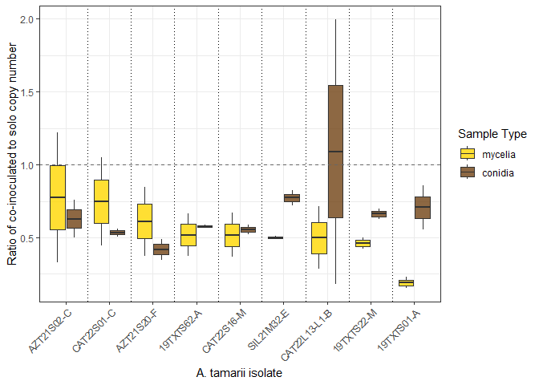<!-- -->

``` r
#now using a lmer for stats
#first need to clean names
#clean contrast names
tam_suppression_m_for_model <- tam_suppression_m

tam_suppression_m_for_model$Isolate1 <- tam_suppression_m$Isolate1 %>%
  gsub("-", "_", .)    # collapse  "-" to "_"

model_tm_logRR <- lmer(log(reduction_ratio) ~ Isolate1 + (1 | Experiment), data = tam_suppression_m_for_model)

#generate data for Table S3
summary(model_tm_logRR)
```

    ## Linear mixed model fit by REML ['lmerMod']
    ## Formula: log(reduction_ratio) ~ Isolate1 + (1 | Experiment)
    ##    Data: tam_suppression_m_for_model
    ## 
    ## REML criterion at convergence: 17.3
    ## 
    ## Scaled residuals: 
    ##     Min      1Q  Median      3Q     Max 
    ## -1.2816 -0.4832  0.0000  0.4832  1.2816 
    ## 
    ## Random effects:
    ##  Groups     Name        Variance Std.Dev.
    ##  Experiment (Intercept) 0.1071   0.3273  
    ##  Residual               0.1617   0.4022  
    ## Number of obs: 18, groups:  Experiment, 2
    ## 
    ## Fixed effects:
    ##                       Estimate Std. Error t value
    ## (Intercept)            -1.6790     0.3667  -4.579
    ## Isolate119TXTS22_M      0.9009     0.4022   2.240
    ## Isolate119TXTS62_A      0.9828     0.4022   2.444
    ## Isolate1AZT21S02_C      1.2248     0.4022   3.046
    ## Isolate1AZT21S20_F      1.1051     0.4022   2.748
    ## Isolate1CAT22L13_L1_B   0.8838     0.4022   2.198
    ## Isolate1CAT22S01_C      1.2989     0.4022   3.230
    ## Isolate1CAT22S16_M      0.9765     0.4022   2.428
    ## Isolate1SIL21M32_E      0.9862     0.4022   2.452
    ## 
    ## Correlation of Fixed Effects:
    ##             (Intr) I119TXTS2 I119TXTS6 I1AZT21S0 I1AZT21S2 I1CAT22L I1CAT22S0
    ## I119TXTS22_ -0.548                                                           
    ## I119TXTS62_ -0.548  0.500                                                    
    ## I1AZT21S02_ -0.548  0.500     0.500                                          
    ## I1AZT21S20_ -0.548  0.500     0.500     0.500                                
    ## I1CAT22L13_ -0.548  0.500     0.500     0.500     0.500                      
    ## I1CAT22S01_ -0.548  0.500     0.500     0.500     0.500     0.500            
    ## I1CAT22S16_ -0.548  0.500     0.500     0.500     0.500     0.500    0.500   
    ## I1SIL21M32_ -0.548  0.500     0.500     0.500     0.500     0.500    0.500   
    ##             I1CAT22S1
    ## I119TXTS22_          
    ## I119TXTS62_          
    ## I1AZT21S02_          
    ## I1AZT21S20_          
    ## I1CAT22L13_          
    ## I1CAT22S01_          
    ## I1CAT22S16_          
    ## I1SIL21M32_  0.500

``` r
emm_logRR_tm <- emmeans(model_tm_logRR, ~ Isolate1)
pairs_logRR_tm <- contrast(emm_logRR_tm, method = "pairwise")
# Get summary of pairwise comparisons
summary_logRR_tm <- summary(pairs_logRR_tm)

##TEST
# Clean contrast names
summary_logRR_tm$contrast <- gsub(" ", "", summary_logRR_tm$contrast)

# Assign names and run multcompLetters
pvals_logRR_tm <- summary_logRR_tm$p.value
names(pvals_logRR_tm) <- summary_logRR_tm$contrast

letters_logRR_tm <- multcompLetters(pvals_logRR_tm)
print(letters_logRR_tm$Letters)
```

    ##    19TXTS01_A    19TXTS22_M    19TXTS62_A    AZT21S02_C    AZT21S20_F 
    ##           "a"           "a"           "a"           "a"           "a" 
    ## CAT22L13_L1_B    CAT22S01_C    CAT22S16_M    SIL21M32_E 
    ##           "a"           "a"           "a"           "a"

``` r
#no sigs

#do the same for conidia
tam_suppression_s_for_model <- tam_suppression_s

tam_suppression_s_for_model$Isolate1 <- tam_suppression_s$Isolate1 %>%
  gsub("-", "_", .)    # collapse  "-" to "_"

model_ts_logRR <- lmer(log(reduction_ratio) ~ Isolate1 + (1 | Experiment), data = tam_suppression_s_for_model)

#generate data for Table S4
summary(model_ts_logRR)
```

    ## Linear mixed model fit by REML ['lmerMod']
    ## Formula: log(reduction_ratio) ~ Isolate1 + (1 | Experiment)
    ##    Data: tam_suppression_s_for_model
    ## 
    ## REML criterion at convergence: 22.2
    ## 
    ## Scaled residuals: 
    ##     Min      1Q  Median      3Q     Max 
    ## -2.0109 -0.1315  0.0000  0.1315  2.0109 
    ## 
    ## Random effects:
    ##  Groups     Name        Variance Std.Dev.
    ##  Experiment (Intercept) 0.005859 0.07655 
    ##  Residual               0.341367 0.58427 
    ## Number of obs: 18, groups:  Experiment, 2
    ## 
    ## Fixed effects:
    ##                       Estimate Std. Error t value
    ## (Intercept)           -0.37089    0.41667  -0.890
    ## Isolate119TXTS22_M    -0.04227    0.58427  -0.072
    ## Isolate119TXTS62_A    -0.18114    0.58427  -0.310
    ## Isolate1AZT21S02_C    -0.11484    0.58427  -0.197
    ## Isolate1AZT21S20_F    -0.51398    0.58427  -0.880
    ## Isolate1CAT22L13_L1_B -0.13173    0.58427  -0.225
    ## Isolate1CAT22S01_C    -0.25732    0.58427  -0.440
    ## Isolate1CAT22S16_M    -0.21932    0.58427  -0.375
    ## Isolate1SIL21M32_E     0.11177    0.58427   0.191
    ## 
    ## Correlation of Fixed Effects:
    ##             (Intr) I119TXTS2 I119TXTS6 I1AZT21S0 I1AZT21S2 I1CAT22L I1CAT22S0
    ## I119TXTS22_ -0.701                                                           
    ## I119TXTS62_ -0.701  0.500                                                    
    ## I1AZT21S02_ -0.701  0.500     0.500                                          
    ## I1AZT21S20_ -0.701  0.500     0.500     0.500                                
    ## I1CAT22L13_ -0.701  0.500     0.500     0.500     0.500                      
    ## I1CAT22S01_ -0.701  0.500     0.500     0.500     0.500     0.500            
    ## I1CAT22S16_ -0.701  0.500     0.500     0.500     0.500     0.500    0.500   
    ## I1SIL21M32_ -0.701  0.500     0.500     0.500     0.500     0.500    0.500   
    ##             I1CAT22S1
    ## I119TXTS22_          
    ## I119TXTS62_          
    ## I1AZT21S02_          
    ## I1AZT21S20_          
    ## I1CAT22L13_          
    ## I1CAT22S01_          
    ## I1CAT22S16_          
    ## I1SIL21M32_  0.500

``` r
emm_logRR_ts <- emmeans(model_ts_logRR, ~ Isolate1)
pairs_logRR_ts <- contrast(emm_logRR_ts, method = "pairwise")
# Get summary of pairwise comparisons
summary_logRR_ts <- summary(pairs_logRR_ts)

##TEST
# Clean contrast names
summary_logRR_ts$contrast <- gsub(" ", "", summary_logRR_ts$contrast)

# Assign names and run multcompLetters
pvals_logRR_ts <- summary_logRR_ts$p.value
names(pvals_logRR_ts) <- summary_logRR_ts$contrast

letters_logRR_ts <- multcompLetters(pvals_logRR_ts)
print(letters_logRR_ts$Letters)
```

    ##    19TXTS01_A    19TXTS22_M    19TXTS62_A    AZT21S02_C    AZT21S20_F 
    ##           "a"           "a"           "a"           "a"           "a" 
    ## CAT22L13_L1_B    CAT22S01_C    CAT22S16_M    SIL21M32_E 
    ##           "a"           "a"           "a"           "a"

``` r
#no sigs
```

\#now for flavus

``` r
flav_suppression_m <- flav_suppression_m %>% mutate(SampleType = "Maize")
flav_suppression_s <- flav_suppression_s %>% mutate(SampleType = "Spores")
flav_suppression_combined <- bind_rows(flav_suppression_m, flav_suppression_s)

flav_suppression_combined_fixname <- flav_suppression_combined %>%
  mutate(
    SampleType = recode(SampleType,
                       "Maize"  = "mycelia",
                       "Spores" = "conidia"),
    Isolate1 = recode(Isolate1,
                      "EB01" = "East Bernard-O",
                      "DV901" = "Danevang-3-K",
                      "V-MR17" = "30110-3508-C",
                      "BA12-J" = "BAJ12")
  )


# Get the maize-based isolate order
maize_order_red_f <- flav_suppression_combined_fixname %>%
  filter(SampleType == "mycelia") %>%  # Filter to mycelia only
  group_by(Isolate1) %>%
  summarize(mean_reduction_ratio = mean(reduction_ratio, na.rm = TRUE)) %>%
  arrange(desc(mean_reduction_ratio)) %>%
  pull(Isolate1)

flav_suppression_combined_fixname <- flav_suppression_combined_fixname %>%
  mutate(Isolate1 = factor(Isolate1, levels = maize_order_red_f))

# Set 'mycelia' as the first factor level
flav_suppression_combined_fixname$SampleType <- factor(
  flav_suppression_combined_fixname$SampleType,
  levels = c("mycelia", "conidia")
)

#drop controls
flav_suppression_combined_fixname <- filter(flav_suppression_combined_fixname, Isolate1 != "Water")

########################
##FIGURE 4 NEW #########

ggplot(flav_suppression_combined_fixname,
       aes(x = Isolate1, y = reduction_ratio, fill = SampleType)) +
  geom_boxplot(outlier.shape = NA, alpha = 0.8) +
  #geom_jitter(aes(color = Experiment),
          #    width = 0.2, size = 2) +
  theme_bw() +
  scale_fill_manual(values = c("mycelia" = "#FFD700", "conidia" = "#4A5D23")) +
  labs(x = "A. flavus isolate",
    y = "Ratio of co-inoculated to solo copy number",
    fill = "Sample Type",
    color = "Experiment"
  ) +
  geom_hline(yintercept = 1, linetype = "dashed", color = "gray40")+
  theme(axis.text.x = element_text(angle = 45, hjust = 1, size=8))+
  geom_vline(xintercept = 1.5, color = "black", linetype = "dotted")+
  geom_vline(xintercept = 2.5, color = "black", linetype = "dotted")+
  geom_vline(xintercept = 3.5, color = "black", linetype = "dotted")+
  geom_vline(xintercept = 4.5, color = "black", linetype = "dotted")+
  geom_vline(xintercept = 5.5, color = "black", linetype = "dotted")+
  geom_vline(xintercept = 6.5, color = "black", linetype = "dotted")+
  geom_vline(xintercept = 7.5, color = "black", linetype = "dotted")+
  geom_vline(xintercept = 8.5, color = "black", linetype = "dotted")
```

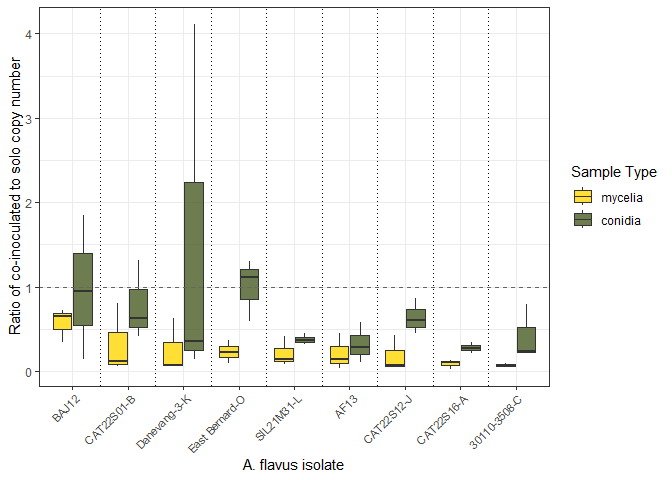<!-- -->

``` r
#now using a lmer for stats
#first need to clean names
#clean contrast names
flav_suppression_m_for_model <- flav_suppression_m

flav_suppression_m_for_model$Isolate1 <- flav_suppression_m$Isolate1 %>%
  gsub("-", "_", .)    # collapse  "-" to "_"

model_fm_logRR <- lmer(log(reduction_ratio) ~ Isolate1 + (1 | Experiment), data = flav_suppression_m_for_model)

#generate data for Table S5
summary(model_fm_logRR)
```

    ## Linear mixed model fit by REML ['lmerMod']
    ## Formula: log(reduction_ratio) ~ Isolate1 + (1 | Experiment)
    ##    Data: flav_suppression_m_for_model
    ## 
    ## REML criterion at convergence: 51.5
    ## 
    ## Scaled residuals: 
    ##     Min      1Q  Median      3Q     Max 
    ## -1.2129 -0.4678 -0.2198  0.6741  1.6320 
    ## 
    ## Random effects:
    ##  Groups     Name        Variance Std.Dev.
    ##  Experiment (Intercept) 0.4900   0.7000  
    ##  Residual               0.4534   0.6734  
    ## Number of obs: 27, groups:  Experiment, 3
    ## 
    ## Fixed effects:
    ##                    Estimate Std. Error t value
    ## (Intercept)         -2.0196     0.5608  -3.601
    ## Isolate1BA12_J       1.4167     0.5498   2.577
    ## Isolate1CAT22S01_B   0.2980     0.5498   0.542
    ## Isolate1CAT22S12_J  -0.1278     0.5498  -0.233
    ## Isolate1CAT22S16_A  -0.6412     0.5498  -1.166
    ## Isolate1DV901        0.1041     0.5498   0.189
    ## Isolate1EB01         0.3968     0.5498   0.722
    ## Isolate1SIL21M31_L   0.2463     0.5498   0.448
    ## Isolate1V_MR17      -0.6470     0.5498  -1.177
    ## 
    ## Correlation of Fixed Effects:
    ##             (Intr) I1BA12 I1CAT22S0 I1CAT22S12 I1CAT22S16 I1DV90 I1EB01 I1SIL2
    ## Islt1BA12_J -0.490                                                            
    ## I1CAT22S01_ -0.490  0.500                                                     
    ## I1CAT22S12_ -0.490  0.500  0.500                                              
    ## I1CAT22S16_ -0.490  0.500  0.500     0.500                                    
    ## Isolt1DV901 -0.490  0.500  0.500     0.500      0.500                         
    ## Isolat1EB01 -0.490  0.500  0.500     0.500      0.500      0.500              
    ## I1SIL21M31_ -0.490  0.500  0.500     0.500      0.500      0.500  0.500       
    ## Islt1V_MR17 -0.490  0.500  0.500     0.500      0.500      0.500  0.500  0.500

``` r
emm_logRR_fm <- emmeans(model_fm_logRR, ~ Isolate1)
pairs_logRR_fm <- contrast(emm_logRR_fm, method = "pairwise")
# Get summary of pairwise comparisons
summary_logRR_fm <- summary(pairs_logRR_fm)

##TEST
# Clean contrast names
summary_logRR_fm$contrast <- gsub(" ", "", summary_logRR_fm$contrast)

# Assign names and run multcompLetters
pvals_logRR_fm <- summary_logRR_fm$p.value
names(pvals_logRR_fm) <- summary_logRR_fm$contrast

letters_logRR_fm <- multcompLetters(pvals_logRR_fm)
print(letters_logRR_fm$Letters)
```

    ##       AF13     BA12_J CAT22S01_B CAT22S12_J CAT22S16_A      DV901       EB01 
    ##       "ab"        "a"       "ab"       "ab"        "b"       "ab"       "ab" 
    ## SIL21M31_L     V_MR17 
    ##       "ab"        "b"

``` r
#and for conidia
#now using a lmer for stats
#first need to clean names
#clean contrast names
flav_suppression_s_for_model <- flav_suppression_s

flav_suppression_s_for_model$Isolate1 <- flav_suppression_s$Isolate1 %>%
  gsub("-", "_", .)    # collapse  "-" to "_"

model_fs_logRR <- lmer(log(reduction_ratio) ~ Isolate1 + (1 | Experiment), data = flav_suppression_s_for_model)

#generate data for Table S6
summary(model_fs_logRR)
```

    ## Linear mixed model fit by REML ['lmerMod']
    ## Formula: log(reduction_ratio) ~ Isolate1 + (1 | Experiment)
    ##    Data: flav_suppression_s_for_model
    ## 
    ## REML criterion at convergence: 53.4
    ## 
    ## Scaled residuals: 
    ##     Min      1Q  Median      3Q     Max 
    ## -1.7444 -0.2975 -0.1197  0.5312  2.0173 
    ## 
    ## Random effects:
    ##  Groups     Name        Variance Std.Dev.
    ##  Experiment (Intercept) 0.1913   0.4373  
    ##  Residual               0.5607   0.7488  
    ## Number of obs: 27, groups:  Experiment, 3
    ## 
    ## Fixed effects:
    ##                    Estimate Std. Error t value
    ## (Intercept)        -1.34365    0.50065  -2.684
    ## Isolate1BA12_J      0.87694    0.61140   1.434
    ## Isolate1CAT22S01_B  0.99373    0.61140   1.625
    ## Isolate1CAT22S12_J  0.86144    0.61140   1.409
    ## Isolate1CAT22S16_A  0.04043    0.61140   0.066
    ## Isolate1DV901       0.81770    0.61140   1.337
    ## Isolate1EB01        1.29348    0.61140   2.116
    ## Isolate1SIL21M31_L  0.35519    0.61140   0.581
    ## Isolate1V_MR17      0.28086    0.61140   0.459
    ## 
    ## Correlation of Fixed Effects:
    ##             (Intr) I1BA12 I1CAT22S0 I1CAT22S12 I1CAT22S16 I1DV90 I1EB01 I1SIL2
    ## Islt1BA12_J -0.611                                                            
    ## I1CAT22S01_ -0.611  0.500                                                     
    ## I1CAT22S12_ -0.611  0.500  0.500                                              
    ## I1CAT22S16_ -0.611  0.500  0.500     0.500                                    
    ## Isolt1DV901 -0.611  0.500  0.500     0.500      0.500                         
    ## Isolat1EB01 -0.611  0.500  0.500     0.500      0.500      0.500              
    ## I1SIL21M31_ -0.611  0.500  0.500     0.500      0.500      0.500  0.500       
    ## Islt1V_MR17 -0.611  0.500  0.500     0.500      0.500      0.500  0.500  0.500

``` r
emm_logRR_fs <- emmeans(model_fs_logRR, ~ Isolate1)
pairs_logRR_fs <- contrast(emm_logRR_fs, method = "pairwise")
# Get summary of pairwise comparisons
summary_logRR_fs <- summary(pairs_logRR_fs)

##TEST
# Clean contrast names
summary_logRR_fs$contrast <- gsub(" ", "", summary_logRR_fs$contrast)

# Assign names and run multcompLetters
pvals_logRR_fs <- summary_logRR_fs$p.value
names(pvals_logRR_fs) <- summary_logRR_fs$contrast

letters_logRR_fs <- multcompLetters(pvals_logRR_fs)
print(letters_logRR_fs$Letters)
```

    ##       AF13     BA12_J CAT22S01_B CAT22S12_J CAT22S16_A      DV901       EB01 
    ##        "a"        "a"        "a"        "a"        "a"        "a"        "a" 
    ## SIL21M31_L     V_MR17 
    ##        "a"        "a"

How does the ratio of conidia to mycelia in competition compare to solo?

``` r
tam_solo_m_compare <- tam_solo_m
tam_solo_s_compare <- tam_solo_s

#for tamarii
tam_solo_m_compare <- mutate(tam_solo_m_compare, avg_tam_m = avg_tam)

#drop controls
tam_solo_m_compare <- filter(tam_solo_m_compare, Isolate1 != "Water")

#for tamarii
tam_solo_s_compare <- mutate(tam_solo_s_compare, avg_tam_s = avg_tam)

#drop controls
tam_solo_s_summary <- filter(tam_solo_s_summary, Isolate1 != "Water")

#combine
tam_solo_compare_summary <- left_join(tam_solo_m_compare, tam_solo_s_compare, by = c("Isolate1","Rep","Experiment"))


#now for one chart with dataset as Experiment

##############################
##Code for Figure S2 (top)####


ggplot(tam_solo_compare_summary,
       aes(x     = log(avg_tam_m),
           y     = log(avg_tam_s),
           fill = Isolate1,
           shape = Experiment)) +        # map Dataset to shape
  geom_abline(slope = 1,
              intercept = 0,
              linetype = "dashed",
              color = "gray50",
              linewidth=1.5) +
  geom_point(size = 4, alpha = 0.8, color="black") +
  geom_smooth(aes(x = log(avg_tam_m), y = log(avg_tam_s)), method = "lm", se = TRUE,
            color = "gray50", linewidth = 1.2, inherit.aes = FALSE)+
  scale_fill_colorblind(name = "Isolate") +
  scale_shape_manual(
    name   = "Experiment",
    values = c("B" = 22,    # triangle
               "C" = 23)    # square
  ) +
  guides(
    fill = guide_legend(
      override.aes = list(
        shape  = 21,        # use a fill‐capable shape in the legend
        colour = "black",   # keep the black border
        size   = 4          # match your plot size
      )
    )
  ) +
  labs(
    x     = "log(A. tamarii mycelia solo copy number)",
    y     = "log(A. tamarii conidia solo copy number)",
    fill = "Isolate",
    shape = "Experiment"
  ) +
  theme_bw() +
  theme(
    axis.text.x = element_text(angle = 45, hjust = 1),
    legend.position = "right"
  )
```

    ## `geom_smooth()` using formula = 'y ~ x'

    ## Warning: This manual palette can handle a maximum of 8 values. You have
    ## supplied 9

<!-- -->

``` r
#get the info for the linear model in the figure
model_t_solo <- lm(log(avg_tam_s) ~ log(avg_tam_m), data = tam_solo_compare_summary)
summary(model_t_solo)
```

    ## 
    ## Call:
    ## lm(formula = log(avg_tam_s) ~ log(avg_tam_m), data = tam_solo_compare_summary)
    ## 
    ## Residuals:
    ##      Min       1Q   Median       3Q      Max 
    ## -0.93526 -0.10110  0.04874  0.14410  0.52598 
    ## 
    ## Coefficients:
    ##                Estimate Std. Error t value Pr(>|t|)    
    ## (Intercept)     6.69167    0.72532   9.226 8.33e-08 ***
    ## log(avg_tam_m)  0.09333    0.06503   1.435     0.17    
    ## ---
    ## Signif. codes:  0 '***' 0.001 '**' 0.01 '*' 0.05 '.' 0.1 ' ' 1
    ## 
    ## Residual standard error: 0.3068 on 16 degrees of freedom
    ## Multiple R-squared:  0.1141, Adjusted R-squared:  0.05869 
    ## F-statistic:  2.06 on 1 and 16 DF,  p-value: 0.1705

``` r
#for flavus


flav_solo_m_compare <- flav_solo_m
flav_solo_s_compare <- flav_solo_s

#for tamarii
flav_solo_m_compare <- mutate(flav_solo_m_compare, avg_flav_m = avg_flav)

#drop controls
flav_solo_m_compare <- filter(flav_solo_m_compare, Isolate1 != "Water")

#for flavarii
flav_solo_s_compare <- mutate(flav_solo_s_compare, avg_flav_s = avg_flav)

#drop controls
flav_solo_s_summary <- filter(flav_solo_s_summary, Isolate1 != "Water")

#combine
flav_solo_compare_summary <- left_join(flav_solo_m_compare, flav_solo_s_compare, by = c("Isolate1","Rep","Experiment"))


#now for one chart with dataset as Experiment

################################
##Code for Figure S2 (bottom)###


ggplot(flav_solo_compare_summary,
       aes(x     = log(avg_flav_m),
           y     = log(avg_flav_s),
           fill = Isolate1,
           shape = Experiment)) +        # map Dataset to shape
  geom_abline(slope = 1,
              intercept = 0,
              linetype = "dashed",
              color = "gray50",
              linewidth=1.5) +
  geom_point(size = 4, alpha = 0.8, color="black") +
  geom_smooth(aes(x = log(avg_flav_m), y = log(avg_flav_s)), method = "lm", se = TRUE,
            color = "gray50", linewidth = 1.2, inherit.aes = FALSE)+
  scale_shape_manual(
  name   = "Experiment",
  values = c("E" = 21, "F" = 22, "G" = 23),
  guide  = guide_legend(order = 2)  # Experiment first
) +
scale_fill_colorblind(
  name  = "Isolate",
  guide = guide_legend(
    order = 1,                     # Isolate second
    override.aes = list(
      shape  = 21,
      colour = "black",
      size   = 4
    )
  )
)+
  labs(
    x     = "log(A. flavus mycelia solo copy number)",
    y     = "log(A. flavus conidia solo copy number)",
    fill = "Isolate",
    shape = "Experiment"
  ) +
  theme_bw() +
  theme(
    axis.text.x = element_text(angle = 45, hjust = 1),
    legend.position = "right"
  )
```

    ## `geom_smooth()` using formula = 'y ~ x'

    ## Warning: This manual palette can handle a maximum of 8 values. You have
    ## supplied 9

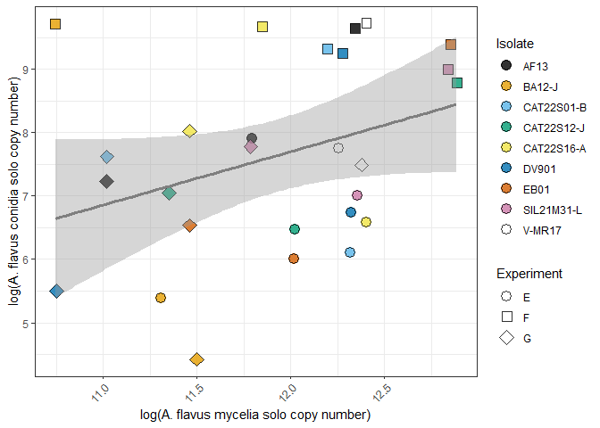<!-- -->

``` r
#get the info for the linear model in the figure
model_f_solo <- lm(log(avg_flav_s) ~ log(avg_flav_m), data = flav_solo_compare_summary)
summary(model_f_solo)
```

    ## 
    ## Call:
    ## lm(formula = log(avg_flav_s) ~ log(avg_flav_m), data = flav_solo_compare_summary)
    ## 
    ## Residuals:
    ##     Min      1Q  Median      3Q     Max 
    ## -2.8540 -1.1875  0.2617  0.8739  3.0715 
    ## 
    ## Coefficients:
    ##                 Estimate Std. Error t value Pr(>|t|)  
    ## (Intercept)      -2.3913     5.4276  -0.441   0.6633  
    ## log(avg_flav_m)   0.8407     0.4546   1.849   0.0763 .
    ## ---
    ## Signif. codes:  0 '***' 0.001 '**' 0.01 '*' 0.05 '.' 0.1 ' ' 1
    ## 
    ## Residual standard error: 1.442 on 25 degrees of freedom
    ## Multiple R-squared:  0.1203, Adjusted R-squared:  0.08514 
    ## F-statistic:  3.42 on 1 and 25 DF,  p-value: 0.07628

aflatoxin plots

``` r
aflaB <- read.csv("./data_for_plots/ExpB_maize_results_wafla.csv")
aflaC <- read.csv("./data_for_plots/ExpC_maize_results_wafla.csv")
aflaE <- read.csv("./data_for_plots/ExpE_maize_results_wafla.csv")
aflaF <- read.csv("./data_for_plots/ExpF_maize_results_wafla.csv")
aflaG <- read.csv("./data_for_plots/ExpG_maize_results_wafla.csv")

#ignore water controls
aflaB <- aflaB[-c(40:42),]
aflaC <- aflaC[-c(40:42),]
aflaE <- aflaE[-c(40:42),]
aflaF <- aflaF[-c(40:42),]
aflaG <- aflaG[-c(40:42),]

# Add an experiment column to each dataset
aflaB <- aflaB %>% mutate(experiment = "ExpB")
aflaC <- aflaC %>% mutate(experiment = "ExpC")
aflaE <- aflaE %>% mutate(experiment = "ExpE")
aflaF <- aflaF %>% mutate(experiment = "ExpF")
aflaG <- aflaG %>% mutate(experiment = "ExpG")


# Combine them into one dataframe
afla_all_t <- bind_rows(aflaB, aflaC)
afla_all_f <- bind_rows(aflaE, aflaF, aflaG)

#fix names for plotting 

afla_all_f <- afla_all_f %>%
  mutate(
    Isolate1 = recode(Isolate1,
                      "EB01" = "East Bernard-O",
                      "DV901" = "Danevang-3-K",
                      "V-MR17" = "30110-3508-C",
                      "BA12-J" = "BAJ12")
  )


# Plot pooled boxplots (ignoring experiment)
#first reorder
afla_all_f$type <- factor(afla_all_f$type,
                          levels = c("competition", "tamarii_control", "single"))

afla_all_f$type <- recode(
  afla_all_f$type,
  "competition"     = "coinoculated",
  "tamarii_control" = "tamarii control",
  "single"          = "solo"
)

#################################
########FIGURE S3 bottom#########

ggplot(afla_all_f,
       aes(x = Isolate1, y = log(aflatoxin_ppb), fill = type)) +
  geom_boxplot() +
  theme_bw() +
  labs(y = "ln aflatoxin (ppb)",
       x = "A. flavus Isolate",
       fill = "Type") +
  theme(axis.text.x = element_text(angle = 45, hjust = 1))+
  geom_vline(xintercept = 1.5, color = "black", linetype = "dotted") +
  geom_vline(xintercept = 2.5, color = "black", linetype = "dotted") +
  geom_vline(xintercept = 3.5, color = "black", linetype = "dotted") +
  geom_vline(xintercept = 4.5, color = "black", linetype = "dotted") +
  geom_vline(xintercept = 5.5, color = "black", linetype = "dotted") +
  geom_vline(xintercept = 6.5, color = "black", linetype = "dotted") +
  geom_vline(xintercept = 7.5, color = "black", linetype = "dotted") +
  geom_vline(xintercept = 8.5, color = "black", linetype = "dotted") +
  geom_vline(xintercept = 9.5, color = "black", linetype = "dotted") 
```

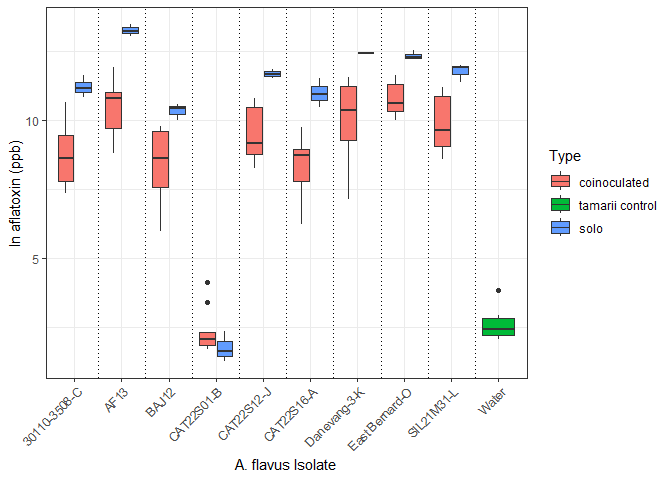<!-- -->

``` r
#do statistical test to see if coinoculated is different than solo (uncorrected)l
solo_means_per_unc <- afla_all_f %>%
  filter(type == "solo") %>%
  group_by(Isolate1, experiment) %>%
  summarize(mean_solo = mean(aflatoxin_ppb, na.rm = TRUE),
            .groups = "drop")

co_means_per_unc <- afla_all_f %>%
  filter(type == "coinoculated") %>%
  group_by(Isolate1, experiment) %>%
  summarize(mean_co = mean(aflatoxin_ppb, na.rm = TRUE),
            .groups = "drop")

paired_per_unc <- left_join(
  solo_means_per_unc,
  co_means_per_unc,
  by = c("Isolate1", "experiment")
)

#remove CAT22S01-B which does not seem to produce aflatoxin
paired_per_unc <- filter(paired_per_unc, Isolate1 != "CAT22S01-B")

t.test(log(paired_per_unc$mean_solo),
       log(paired_per_unc$mean_co),
       paired = TRUE)
```

    ## 
    ##  Paired t-test
    ## 
    ## data:  log(paired_per_unc$mean_solo) and log(paired_per_unc$mean_co)
    ## t = 12.441, df = 23, p-value = 1.072e-11
    ## alternative hypothesis: true mean difference is not equal to 0
    ## 95 percent confidence interval:
    ##  1.744581 2.440446
    ## sample estimates:
    ## mean difference 
    ##        2.092513

``` r
#p-value = 1.072e-11


#plot pooled boxplots for tamarii


afla_all_t$type <- recode(
  afla_all_t$type,
  "competition"     = "coinoculated",
  "flavus_control" = "flavus control",
  "single"          = "solo"
)


##############################
#####FIGURE S3 top###########

ggplot(afla_all_t,
       aes(x = Isolate1, y = log(aflatoxin_ppb), fill = type)) +
  geom_boxplot() +
  theme_bw() +
  labs(y = expression("ln aflatoxin (ppb)"),
       x = "A. tamarii Isolate",
       fill = "Type") +
  theme(axis.text.x = element_text(angle = 45, hjust = 1))+
  geom_vline(xintercept = 1.5, color = "black", linetype = "dotted") +
  geom_vline(xintercept = 2.5, color = "black", linetype = "dotted") +
  geom_vline(xintercept = 3.5, color = "black", linetype = "dotted") +
  geom_vline(xintercept = 4.5, color = "black", linetype = "dotted") +
  geom_vline(xintercept = 5.5, color = "black", linetype = "dotted") +
  geom_vline(xintercept = 6.5, color = "black", linetype = "dotted") +
  geom_vline(xintercept = 7.5, color = "black", linetype = "dotted") +
  geom_vline(xintercept = 8.5, color = "black", linetype = "dotted") +
  geom_vline(xintercept = 9.5, color = "black", linetype = "dotted") 
```

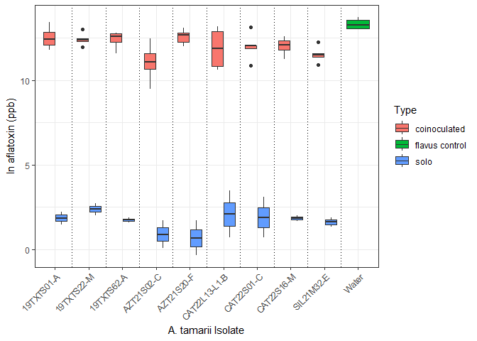<!-- -->

``` r
#now for the tamarii dotplot
afla_all_t_onlycomp <- filter(afla_all_t, type=="coinoculated")


#plot decrease in aflatoxin vs percent tamarii

#############################
######FIGURE 8 top###########

ggplot(afla_all_t_onlycomp,
       aes(x = percent_tam,
           y = percent_decrease_aflatoxin,
           fill = Isolate1,
           shape = experiment)) +
  geom_point(size = 3,
             alpha = 0.9,
             color = "black",          # black outline on points
             stroke = 0.7,
             position = position_jitter(width = 0.15, height = 0)) +
  geom_smooth(
    aes(x = percent_tam, y = percent_decrease_aflatoxin),
    method = "lm",
    se = TRUE,
    color = "black",
    linewidth = 1,
    inherit.aes = FALSE
  ) +
  scale_shape_manual(values = c(21, 22, 24)) +
  scale_fill_colorblind() +
  guides(
    color = "none",                   # hide color legend (outline)
    fill  = guide_legend(             # tell fill legend how to draw keys
      override.aes = list(
        shape  = 21,                  # fill-capable shape
        colour = "black",             # black outline in legend
        stroke = 0.7,
        size   = 3
      )
    )
  ) +
  theme_bw() +
  labs(
    x = "Percent A. tamarii DNA",
    y = "Percent decrease aflatoxin",
    fill = "Isolate",
    shape = "Experiment"
  ) +
  theme(axis.text.x = element_text(angle = 45, hjust = 1))
```

    ## `geom_smooth()` using formula = 'y ~ x'

    ## Warning: This manual palette can handle a maximum of 8 values. You have
    ## supplied 9

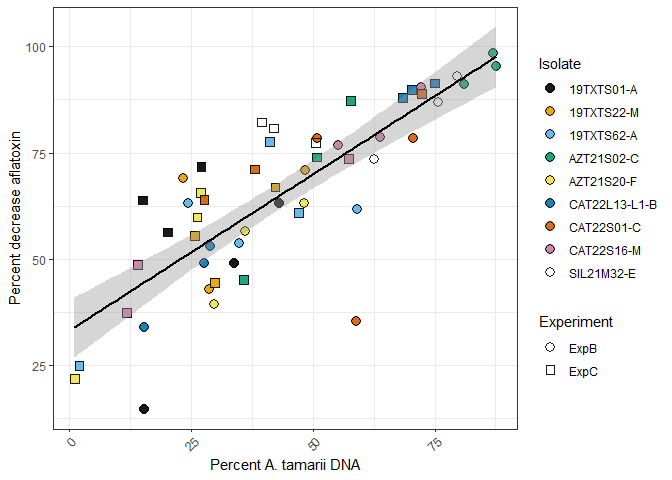<!-- -->

``` r
#print model

model_afla_t <- lm(percent_decrease_aflatoxin ~ percent_tam, data = afla_all_t_onlycomp)
summary(model_afla_t)
```

    ## 
    ## Call:
    ## lm(formula = percent_decrease_aflatoxin ~ percent_tam, data = afla_all_t_onlycomp)
    ## 
    ## Residuals:
    ##     Min      1Q  Median      3Q     Max 
    ## -41.195  -5.637   1.167   7.156  19.768 
    ## 
    ## Coefficients:
    ##             Estimate Std. Error t value Pr(>|t|)    
    ## (Intercept) 33.25126    3.54379   9.383 8.94e-13 ***
    ## percent_tam  0.73539    0.07247  10.148 6.24e-14 ***
    ## ---
    ## Signif. codes:  0 '***' 0.001 '**' 0.01 '*' 0.05 '.' 0.1 ' ' 1
    ## 
    ## Residual standard error: 11.73 on 52 degrees of freedom
    ## Multiple R-squared:  0.6645, Adjusted R-squared:  0.658 
    ## F-statistic:   103 on 1 and 52 DF,  p-value: 6.24e-14

``` r
#plot decrease in aflatoxin vs percent tamarii for the flavus experiments
afla_all_f_onlycomp <- filter(afla_all_f, type=="coinoculated")

############################
#########FIGURE 8 bottom###


ggplot(afla_all_f_onlycomp,
       aes(x = 100-percent_flav,
           y = percent_decrease_aflatoxin,
           fill = Isolate1,
           shape = experiment)) +
  geom_point(size = 3,
             alpha = 0.9,
             color = "black",          # black outline on points
             stroke = 0.7,
             position = position_jitter(width = 0.15, height = 0)) +
  geom_smooth(
    aes(x = 100-percent_flav, y = percent_decrease_aflatoxin),
    method = "lm",
    se = TRUE,
    color = "black",
    linewidth = 1,
    inherit.aes = FALSE
  ) +
  scale_shape_manual(values = c(21, 22, 24)) +
  scale_fill_colorblind() +
  guides(
    color = "none",                   # hide color legend (outline)
    fill  = guide_legend(             # tell fill legend how to draw keys
      override.aes = list(
        shape  = 21,                  # fill-capable shape
        colour = "black",             # black outline in legend
        stroke = 0.7,
        size   = 3
      )
    )
  ) +
  theme_bw() +
  labs(
    x = "Percent A. tamarii DNA",
    y = "Percent decrease aflatoxin",
    fill = "Isolate",
    shape = "Experiment"
  ) +
  theme(axis.text.x = element_text(angle = 45, hjust = 1))
```

    ## `geom_smooth()` using formula = 'y ~ x'

    ## Warning: Removed 9 rows containing non-finite outside the scale range (`stat_smooth()`).
    ## This manual palette can handle a maximum of 8 values. You have supplied 9

    ## Warning: Removed 9 rows containing missing values or values outside the scale range
    ## (`geom_point()`).

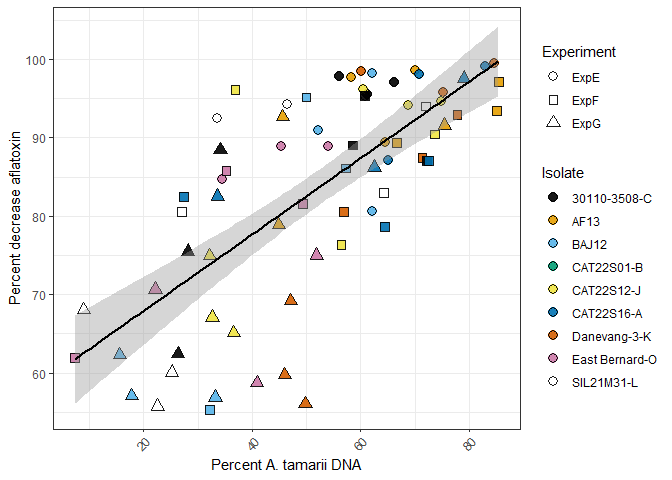<!-- -->

``` r
#get linear model info
afla_all_f_onlycomp$percent_tam <- 100 - afla_all_f_onlycomp$percent_flav

model_afla_f <- lm(percent_decrease_aflatoxin ~ percent_tam, data = afla_all_f_onlycomp)
summary(model_afla_f)
```

    ## 
    ## Call:
    ## lm(formula = percent_decrease_aflatoxin ~ percent_tam, data = afla_all_f_onlycomp)
    ## 
    ## Residuals:
    ##      Min       1Q   Median       3Q      Max 
    ## -26.4426  -6.3656   0.1592   7.6127  19.9142 
    ## 
    ## Coefficients:
    ##             Estimate Std. Error t value Pr(>|t|)    
    ## (Intercept) 58.15588    3.23375  17.984  < 2e-16 ***
    ## percent_tam  0.48784    0.05823   8.377 3.69e-12 ***
    ## ---
    ## Signif. codes:  0 '***' 0.001 '**' 0.01 '*' 0.05 '.' 0.1 ' ' 1
    ## 
    ## Residual standard error: 9.629 on 70 degrees of freedom
    ##   (9 observations deleted due to missingness)
    ## Multiple R-squared:  0.5006, Adjusted R-squared:  0.4935 
    ## F-statistic: 70.18 on 1 and 70 DF,  p-value: 3.689e-12

``` r
#t-test for significance

t.test(afla_all_f_onlycomp$percent_decrease_aflatoxin, afla_all_f_onlycomp$percent_tam, paired = TRUE)
```

    ## 
    ##  Paired t-test
    ## 
    ## data:  afla_all_f_onlycomp$percent_decrease_aflatoxin and afla_all_f_onlycomp$percent_tam
    ## t = 19.284, df = 71, p-value < 2.2e-16
    ## alternative hypothesis: true mean difference is not equal to 0
    ## 95 percent confidence interval:
    ##  28.26501 34.78435
    ## sample estimates:
    ## mean difference 
    ##        31.52468

Maybe aflatoxin per copy number is an interesting comparison. Let’s do
that for the flavus.

``` r
afla_all_f <- mutate(afla_all_f, afla_per_copy = aflatoxin_ppb / avg_flav)


solo_means_per <- afla_all_f %>%
  filter(type == "solo") %>%
  group_by(Isolate1, experiment) %>%
  summarize(mean_solo_per_copy = mean(afla_per_copy, na.rm = TRUE),
            .groups = "drop")

co_means_per <- afla_all_f %>%
  filter(type == "coinoculated") %>%
  group_by(Isolate1, experiment) %>%
  summarize(mean_co_per_copy = mean(afla_per_copy, na.rm = TRUE),
            .groups = "drop")

paired_per <- left_join(
  solo_means_per,
  co_means_per,
  by = c("Isolate1", "experiment")
)


#remove CAT22S01-B which does not seem to produce aflatoxin
paired_per <- filter(paired_per, Isolate1 != "CAT22S01-B")

t.test(log(paired_per$mean_solo_per_copy),
       log(paired_per$mean_co_per_copy),
       paired = TRUE)
```

    ## 
    ##  Paired t-test
    ## 
    ## data:  log(paired_per$mean_solo_per_copy) and log(paired_per$mean_co_per_copy)
    ## t = -0.41368, df = 23, p-value = 0.6829
    ## alternative hypothesis: true mean difference is not equal to 0
    ## 95 percent confidence interval:
    ##  -0.4654521  0.3103173
    ## sample estimates:
    ## mean difference 
    ##     -0.07756736

``` r
#p-value = 0.6829

#for statistical test between isolates
#Table S12
paired_per <- paired_per %>%
  mutate(
    ratio_co_vs_solo = mean_co_per_copy / mean_solo_per_copy,
    log_ratio        = log(ratio_co_vs_solo)
  )

m_afla <- lmer(
  log_ratio ~ Isolate1 + (1 | experiment),
  data = paired_per
)

summary(m_afla)
```

    ## Linear mixed model fit by REML ['lmerMod']
    ## Formula: log_ratio ~ Isolate1 + (1 | experiment)
    ##    Data: paired_per
    ## 
    ## REML criterion at convergence: 47.6
    ## 
    ## Scaled residuals: 
    ##     Min      1Q  Median      3Q     Max 
    ## -1.3479 -0.5853 -0.1156  0.6548  1.5412 
    ## 
    ## Random effects:
    ##  Groups     Name        Variance Std.Dev.
    ##  experiment (Intercept) 0.3328   0.5769  
    ##  Residual               0.5303   0.7283  
    ## Number of obs: 24, groups:  experiment, 3
    ## 
    ## Fixed effects:
    ##                        Estimate Std. Error t value
    ## (Intercept)             0.35634    0.53639   0.664
    ## Isolate1AF13           -0.68983    0.59461  -1.160
    ## Isolate1BAJ12          -1.18011    0.59461  -1.985
    ## Isolate1CAT22S12-J     -0.03719    0.59461  -0.063
    ## Isolate1CAT22S16-A      0.52965    0.59461   0.891
    ## Isolate1Danevang-3-K   -0.51062    0.59461  -0.859
    ## Isolate1East Bernard-O -0.07676    0.59461  -0.129
    ## Isolate1SIL21M31-L     -0.26535    0.59461  -0.446
    ## 
    ## Correlation of Fixed Effects:
    ##             (Intr) I1AF13 I1BAJ1 I1CAT22S12 I1CAT22S16 I1D-3- I1EB-O
    ## Isolat1AF13 -0.554                                                  
    ## Isolt1BAJ12 -0.554  0.500                                           
    ## I1CAT22S12- -0.554  0.500  0.500                                    
    ## I1CAT22S16- -0.554  0.500  0.500  0.500                             
    ## Islt1Dn-3-K -0.554  0.500  0.500  0.500      0.500                  
    ## Islt1EBrn-O -0.554  0.500  0.500  0.500      0.500      0.500       
    ## I1SIL21M31- -0.554  0.500  0.500  0.500      0.500      0.500  0.500

``` r
emm_afla  <- emmeans(m_afla, ~ Isolate1)
pairs_afla <- pairs(emm_afla, adjust = "tukey")

#no significant differnces between isolates. 

#reformat for plotting
paired_per_long <- paired_per %>%
  pivot_longer(
    cols = c(mean_solo_per_copy, mean_co_per_copy),
    names_to = "type",
    values_to = "afla_per_copy"
  ) %>%
  mutate(
    type = ifelse(type == "mean_solo_per_copy", "solo", "co-inoculated")
  ) %>%
  mutate(
    type = factor(type, levels = c("solo", "co-inoculated"))
  )


#match colors
iso_colors <- c(
  "30110-3508-C"        = "#000000",
  "AF13"       = "#E69F00",
  "BAJ12"      = "#56B4E9",
  "CAT22S01-B"  = "#009E73",
  "CAT22S12-J"       = "#F0E442",
  "CAT22S16-A"         = "#0072B2",
  "Danevang-3-K"   = "#D55E00",
  "East Bernard-O"       = "#CC79A7",
  "SIL21M31-L"       = "#FFFFFF"
)
#for order
solo_order <- paired_per_long %>%
  filter(type == "solo") %>%
  group_by(Isolate1) %>%
  summarize(mean_solo = mean(afla_per_copy, na.rm = TRUE)) %>%
  arrange(desc(mean_solo))

paired_per_long$Isolate1 <- factor(
  paired_per_long$Isolate1,
  levels = solo_order$Isolate1
)


###################################
#####FIGURE 9 bottom####################


#plot
ggplot(paired_per_long,
       aes(x = Isolate1,
           y = afla_per_copy,
           fill = type)) +
  
  geom_boxplot(
    outlier.shape = NA,
    width = 0.7,
    color = "black"
  ) +
  scale_fill_manual(
    values = c(
      "solo"          = "#619CFF",
      "co-inoculated" = "#F8766D"
    )
  ) +
  geom_vline(xintercept = 1.5, color = "black", linetype = "dotted") +
  geom_vline(xintercept = 2.5, color = "black", linetype = "dotted") +
  geom_vline(xintercept = 3.5, color = "black", linetype = "dotted") +
  geom_vline(xintercept = 4.5, color = "black", linetype = "dotted") +
  geom_vline(xintercept = 5.5, color = "black", linetype = "dotted") +
  geom_vline(xintercept = 6.5, color = "black", linetype = "dotted") +
  geom_vline(xintercept = 7.5, color = "black", linetype = "dotted") +
  theme_bw() +
  labs(
    x = "A. flavus Isolate",
    y = "Aflatoxin (ppb) per 
    A. flavus DNA copy number",
    fill = "Treatment"
  ) +
  
  theme(
    axis.text.x = element_text(angle = 45, hjust = 1),
    legend.position = "right"
  )
```

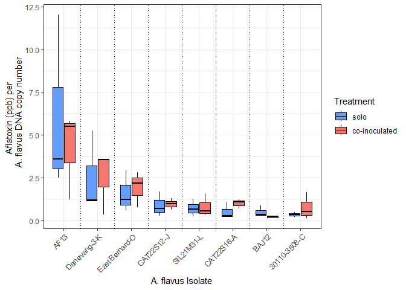<!-- -->

``` r
#now to test differences in solo only

solo_only <- afla_all_f %>%
  filter(type == "solo") %>%
  filter(Isolate1 != "CAT22S01-B")   # optional, since it produces no toxin


m_solo <- lmer(
  afla_per_copy ~ Isolate1 + (1 | experiment),
  data = solo_only
)

summary(m_solo)
```

    ## Linear mixed model fit by REML ['lmerMod']
    ## Formula: afla_per_copy ~ Isolate1 + (1 | experiment)
    ##    Data: solo_only
    ## 
    ## REML criterion at convergence: 75.4
    ## 
    ## Scaled residuals: 
    ##      Min       1Q   Median       3Q      Max 
    ## -1.62227 -0.35304  0.08598  0.23225  2.74169 
    ## 
    ## Random effects:
    ##  Groups     Name        Variance Std.Dev.
    ##  experiment (Intercept) 1.295    1.138   
    ##  Residual               3.139    1.772   
    ## Number of obs: 24, groups:  experiment, 3
    ## 
    ## Fixed effects:
    ##                        Estimate Std. Error t value
    ## (Intercept)              0.3424     1.2157   0.282
    ## Isolate1AF13             5.6959     1.4466   3.937
    ## Isolate1BAJ12            0.1541     1.4466   0.107
    ## Isolate1CAT22S12-J       0.5419     1.4466   0.375
    ## Isolate1CAT22S16-A       0.1762     1.4466   0.122
    ## Isolate1Danevang-3-K     2.1899     1.4466   1.514
    ## Isolate1East Bernard-O   1.2347     1.4466   0.854
    ## Isolate1SIL21M31-L       0.3710     1.4466   0.256
    ## 
    ## Correlation of Fixed Effects:
    ##             (Intr) I1AF13 I1BAJ1 I1CAT22S12 I1CAT22S16 I1D-3- I1EB-O
    ## Isolat1AF13 -0.595                                                  
    ## Isolt1BAJ12 -0.595  0.500                                           
    ## I1CAT22S12- -0.595  0.500  0.500                                    
    ## I1CAT22S16- -0.595  0.500  0.500  0.500                             
    ## Islt1Dn-3-K -0.595  0.500  0.500  0.500      0.500                  
    ## Islt1EBrn-O -0.595  0.500  0.500  0.500      0.500      0.500       
    ## I1SIL21M31- -0.595  0.500  0.500  0.500      0.500      0.500  0.500

``` r
emm_solo <- emmeans(m_solo, ~ Isolate1)
pairs_solo <- pairs(emm_solo, adjust = "tukey")

#now to test differences in co-inoculated only
co_only <- afla_all_f %>%
  filter(type == "coinoculated") %>%
  filter(Isolate1 != "CAT22S01-B")   # optional, since it produces no toxin


m_co <- lmer(
  afla_per_copy ~ Isolate1 + (1 | experiment),
  data = co_only
)

summary(m_co)
```

    ## Linear mixed model fit by REML ['lmerMod']
    ## Formula: afla_per_copy ~ Isolate1 + (1 | experiment)
    ##    Data: co_only
    ## 
    ## REML criterion at convergence: 272.3
    ## 
    ## Scaled residuals: 
    ##     Min      1Q  Median      3Q     Max 
    ## -2.1646 -0.4034 -0.0987  0.2506  4.2868 
    ## 
    ## Random effects:
    ##  Groups     Name        Variance Std.Dev.
    ##  experiment (Intercept) 0.6229   0.7892  
    ##  Residual               2.9624   1.7212  
    ## Number of obs: 72, groups:  experiment, 3
    ## 
    ## Fixed effects:
    ##                        Estimate Std. Error t value
    ## (Intercept)              0.7591     0.7327   1.036
    ## Isolate1AF13             3.4281     0.8114   4.225
    ## Isolate1BAJ12           -0.5581     0.8114  -0.688
    ## Isolate1CAT22S12-J       0.2117     0.8114   0.261
    ## Isolate1CAT22S16-A       0.2445     0.8114   0.301
    ## Isolate1Danevang-3-K     1.7445     0.8114   2.150
    ## Isolate1East Bernard-O   1.1713     0.8114   1.444
    ## Isolate1SIL21M31-L       0.0475     0.8114   0.059
    ## 
    ## Correlation of Fixed Effects:
    ##             (Intr) I1AF13 I1BAJ1 I1CAT22S12 I1CAT22S16 I1D-3- I1EB-O
    ## Isolat1AF13 -0.554                                                  
    ## Isolt1BAJ12 -0.554  0.500                                           
    ## I1CAT22S12- -0.554  0.500  0.500                                    
    ## I1CAT22S16- -0.554  0.500  0.500  0.500                             
    ## Islt1Dn-3-K -0.554  0.500  0.500  0.500      0.500                  
    ## Islt1EBrn-O -0.554  0.500  0.500  0.500      0.500      0.500       
    ## I1SIL21M31- -0.554  0.500  0.500  0.500      0.500      0.500  0.500

``` r
emm_co <- emmeans(m_co, ~ Isolate1)
pairs_co <- pairs(emm_co, adjust = "tukey")
```

Now let’s do the tamarii analysis. Does a.tamarii identity influence
AF13’s per-copy-number aflatoxin production?

``` r
#getAF13 only 
af13_data <- afla_all_t %>%
  filter(Isolate2 == "AF13")

#compute per copy number
af13_data <- af13_data %>%
  mutate(afla_per_copy = aflatoxin_ppb / avg_flav)

#add variable
af13_data <- af13_data %>%
  mutate(
    competitor = ifelse(Isolate1 == "Water", "solo AF13", Isolate1)
  )

#set the order
af13_data$competitor <- factor(
  af13_data$competitor,
  levels = c("solo AF13", sort(unique(af13_data$competitor[af13_data$competitor != "solo AF13"])))
)

m_tam <- lmer(
  log(afla_per_copy) ~ competitor + (1 | experiment),
  data = af13_data
)
summary(m_tam)
```

    ## Linear mixed model fit by REML ['lmerMod']
    ## Formula: log(afla_per_copy) ~ competitor + (1 | experiment)
    ##    Data: af13_data
    ## 
    ## REML criterion at convergence: 109
    ## 
    ## Scaled residuals: 
    ##      Min       1Q   Median       3Q      Max 
    ## -2.30786 -0.68204  0.06036  0.42745  2.10730 
    ## 
    ## Random effects:
    ##  Groups     Name        Variance Std.Dev.
    ##  experiment (Intercept) 5.6999   2.387   
    ##  Residual               0.3192   0.565   
    ## Number of obs: 60, groups:  experiment, 2
    ## 
    ## Fixed effects:
    ##                         Estimate Std. Error t value
    ## (Intercept)               2.0015     1.7039   1.175
    ## competitor19TXTS01-A     -0.1012     0.3262  -0.310
    ## competitor19TXTS22-M     -0.5583     0.3262  -1.712
    ## competitor19TXTS62-A     -0.2354     0.3262  -0.722
    ## competitorAZT21S02-C     -1.0250     0.3262  -3.142
    ## competitorAZT21S20-F     -0.2163     0.3262  -0.663
    ## competitorCAT22L13-L1-B  -0.6443     0.3262  -1.975
    ## competitorCAT22S01-C     -0.5224     0.3262  -1.601
    ## competitorCAT22S16-M     -0.3889     0.3262  -1.192
    ## competitorSIL21M32-E     -0.8396     0.3262  -2.574
    ## 
    ## Correlation of Fixed Effects:
    ##             (Intr) c19TXTS0 c19TXTS2 c19TXTS6 cAZT21S0 cAZT21S2 cCAT22L
    ## c19TXTS01-A -0.096                                                     
    ## c19TXTS22-M -0.096  0.500                                              
    ## c19TXTS62-A -0.096  0.500    0.500                                     
    ## cAZT21S02-C -0.096  0.500    0.500    0.500                            
    ## cAZT21S20-F -0.096  0.500    0.500    0.500    0.500                   
    ## cCAT22L13-L -0.096  0.500    0.500    0.500    0.500    0.500          
    ## cCAT22S01-C -0.096  0.500    0.500    0.500    0.500    0.500    0.500 
    ## cCAT22S16-M -0.096  0.500    0.500    0.500    0.500    0.500    0.500 
    ## cSIL21M32-E -0.096  0.500    0.500    0.500    0.500    0.500    0.500 
    ##             cCAT22S0 cCAT22S1
    ## c19TXTS01-A                  
    ## c19TXTS22-M                  
    ## c19TXTS62-A                  
    ## cAZT21S02-C                  
    ## cAZT21S20-F                  
    ## cCAT22L13-L                  
    ## cCAT22S01-C                  
    ## cCAT22S16-M  0.500           
    ## cSIL21M32-E  0.500    0.500

``` r
emm_tam   <- emmeans(m_tam, ~ competitor)
pairs_tam <- pairs(emm_tam, adjust = "tukey")

#plot with experiments separate
ggplot(af13_data,
       aes(x = competitor,
           y = afla_per_copy,
           fill = experiment)) +
  geom_boxplot(outlier.shape = NA) +
  scale_y_log10() +
  theme_bw() +
  labs(
    x = "A. tamarii isolate",
    y = "Aflatoxin per AF13 copy (log scale)",
    fill = "Experiment"
  ) +
  theme(axis.text.x = element_text(angle = 45, hjust = 1))
```

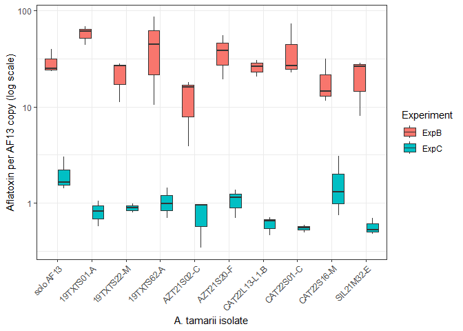<!-- -->

``` r
#yikes huge experimental effects. 
#so now we normalize to the means within experiments
af13_norm <- af13_data %>%
  group_by(experiment) %>%
  mutate(
    exp_mean = mean(afla_per_copy, na.rm = TRUE),
    norm_ratio = afla_per_copy / exp_mean
  ) %>%
  ungroup()


#reorder
comp_order <- af13_norm %>%
  group_by(competitor) %>%
  summarize(mean_norm = mean(norm_ratio, na.rm = TRUE)) %>%
  arrange(desc(mean_norm)) %>%   # or arrange(mean_norm) if you want low → high
  pull(competitor)

af13_norm$competitor <- factor(af13_norm$competitor, levels = comp_order)


# build a fill vector: solo = blue, all others = orange
fill_vals <- c(
  "solo AF13" = "#619CFF",
  setNames(
    rep("#F8766D", length(levels(af13_norm$competitor)) - 1),
    levels(af13_norm$competitor)[levels(af13_norm$competitor) != "solo AF13"]
  ))

#reorder
comp_order <- af13_norm %>%
  group_by(competitor) %>%
  summarize(mean_norm = mean(norm_ratio, na.rm = TRUE)) %>%
  arrange(desc(mean_norm)) %>%   # or arrange(mean_norm) if you want low → high
  pull(competitor)

##################################
#######FIGURE 9 top##############


ggplot(af13_norm,
       aes(x = competitor,
           y = norm_ratio,
           fill = competitor)) +
  geom_boxplot(outlier.shape = NA, width = 0.7, color = "black") +
  scale_fill_manual(values = fill_vals) +
  theme_bw() +
  labs(
    x = "A. tamarii competitor",
    y = "Normalized aflatoxin (ppb)
    per AF13 copy number",
    fill = "Competitor"
  ) +
  theme(axis.text.x = element_text(angle = 45, hjust = 1), legend.position="none")+
  geom_vline(xintercept = 1.5, color = "black", linetype = "dotted") +
  geom_vline(xintercept = 2.5, color = "black", linetype = "dotted") +
  geom_vline(xintercept = 3.5, color = "black", linetype = "dotted") +
  geom_vline(xintercept = 4.5, color = "black", linetype = "dotted") +
  geom_vline(xintercept = 5.5, color = "black", linetype = "dotted") +
  geom_vline(xintercept = 6.5, color = "black", linetype = "dotted") +
  geom_vline(xintercept = 7.5, color = "black", linetype = "dotted") +
  geom_vline(xintercept = 8.5, color = "black", linetype = "dotted") +
  geom_vline(xintercept = 9.5, color = "black", linetype = "dotted") 
```

<!-- -->

``` r
ggplot(af13_norm,
       aes(x = competitor,
           y = norm_ratio,
           fill = competitor)) +
  geom_boxplot(outlier.shape = NA, width = 0.7, color = "black") +
  scale_fill_manual(values = fill_vals) +
  theme_bw() +
  labs(
    x = "A. tamarii competitor",
    y = "Normalized aflatoxin (ppb)\nper AF13 copy number"
  ) +
  theme(
    axis.text.x = element_text(angle = 45, hjust = 1),
    legend.position = "none"
  ) +
  geom_vline(xintercept = 1.5:9.5, color = "black", linetype = "dotted")
```

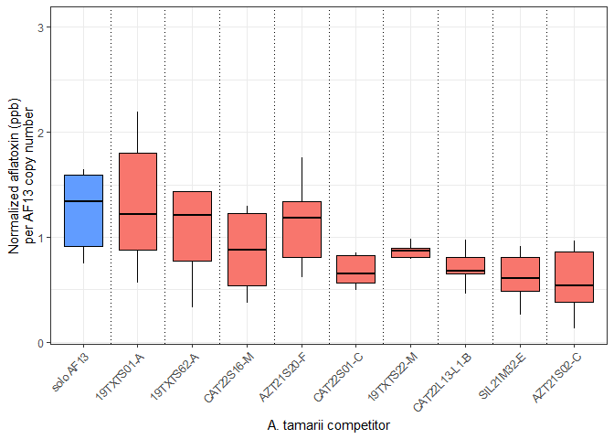<!-- -->

``` r
af13_norm$competitor <- factor(af13_norm$competitor, levels = comp_order)

m_norm <- lmer(
  log(norm_ratio) ~ competitor + (1 | experiment),
  data = af13_norm
)
```

    ## boundary (singular) fit: see help('isSingular')

``` r
#For Table S11
summary(m_norm)
```

    ## Linear mixed model fit by REML ['lmerMod']
    ## Formula: log(norm_ratio) ~ competitor + (1 | experiment)
    ##    Data: af13_norm
    ## 
    ## REML criterion at convergence: 101.9
    ## 
    ## Scaled residuals: 
    ##     Min      1Q  Median      3Q     Max 
    ## -2.3900 -0.6242  0.1203  0.4881  2.1878 
    ## 
    ## Random effects:
    ##  Groups     Name        Variance Std.Dev.
    ##  experiment (Intercept) 0.0000   0.0000  
    ##  Residual               0.3141   0.5604  
    ## Number of obs: 60, groups:  experiment, 2
    ## 
    ## Fixed effects:
    ##                         Estimate Std. Error t value
    ## (Intercept)               0.2782     0.2288   1.216
    ## competitor19TXTS01-A     -0.1012     0.3236  -0.313
    ## competitor19TXTS62-A     -0.2354     0.3236  -0.728
    ## competitorCAT22S16-M     -0.3889     0.3236  -1.202
    ## competitorAZT21S20-F     -0.2163     0.3236  -0.668
    ## competitorCAT22S01-C     -0.5224     0.3236  -1.614
    ## competitor19TXTS22-M     -0.5583     0.3236  -1.726
    ## competitorCAT22L13-L1-B  -0.6443     0.3236  -1.991
    ## competitorSIL21M32-E     -0.8396     0.3236  -2.595
    ## competitorAZT21S02-C     -1.0250     0.3236  -3.168
    ## 
    ## Correlation of Fixed Effects:
    ##             (Intr) c19TXTS0 c19TXTS6 cCAT22S1 cAZT21S2 cCAT22S0 c19TXTS2
    ## c19TXTS01-A -0.707                                                      
    ## c19TXTS62-A -0.707  0.500                                               
    ## cCAT22S16-M -0.707  0.500    0.500                                      
    ## cAZT21S20-F -0.707  0.500    0.500    0.500                             
    ## cCAT22S01-C -0.707  0.500    0.500    0.500    0.500                    
    ## c19TXTS22-M -0.707  0.500    0.500    0.500    0.500    0.500           
    ## cCAT22L13-L -0.707  0.500    0.500    0.500    0.500    0.500    0.500  
    ## cSIL21M32-E -0.707  0.500    0.500    0.500    0.500    0.500    0.500  
    ## cAZT21S02-C -0.707  0.500    0.500    0.500    0.500    0.500    0.500  
    ##             cCAT22L cSIL21
    ## c19TXTS01-A               
    ## c19TXTS62-A               
    ## cCAT22S16-M               
    ## cAZT21S20-F               
    ## cCAT22S01-C               
    ## c19TXTS22-M               
    ## cCAT22L13-L               
    ## cSIL21M32-E  0.500        
    ## cAZT21S02-C  0.500   0.500
    ## optimizer (nloptwrap) convergence code: 0 (OK)
    ## boundary (singular) fit: see help('isSingular')

``` r
emm_norm <- emmeans(m_norm, ~ competitor)
pairs(emm_norm)
```

    ##  contrast                       estimate    SE df t.ratio p.value
    ##  solo AF13 - (19TXTS01-A)         0.1012 0.324 49   0.313  1.0000
    ##  solo AF13 - (19TXTS62-A)         0.2354 0.324 49   0.728  0.9992
    ##  solo AF13 - (CAT22S16-M)         0.3889 0.324 49   1.202  0.9686
    ##  solo AF13 - (AZT21S20-F)         0.2163 0.324 49   0.668  0.9996
    ##  solo AF13 - (CAT22S01-C)         0.5224 0.324 49   1.614  0.8347
    ##  solo AF13 - (19TXTS22-M)         0.5583 0.324 49   1.726  0.7758
    ##  solo AF13 - (CAT22L13-L1-B)      0.6443 0.324 49   1.991  0.6088
    ##  solo AF13 - (SIL21M32-E)         0.8396 0.324 49   2.595  0.2475
    ##  solo AF13 - (AZT21S02-C)         1.0250 0.324 49   3.168  0.0718
    ##  (19TXTS01-A) - (19TXTS62-A)      0.1342 0.324 49   0.415  1.0000
    ##  (19TXTS01-A) - (CAT22S16-M)      0.2877 0.324 49   0.889  0.9961
    ##  (19TXTS01-A) - (AZT21S20-F)      0.1151 0.324 49   0.356  1.0000
    ##  (19TXTS01-A) - (CAT22S01-C)      0.4212 0.324 49   1.302  0.9485
    ##  (19TXTS01-A) - (19TXTS22-M)      0.4571 0.324 49   1.413  0.9173
    ##  (19TXTS01-A) - (CAT22L13-L1-B)   0.5431 0.324 49   1.679  0.8017
    ##  (19TXTS01-A) - (SIL21M32-E)      0.7384 0.324 49   2.282  0.4183
    ##  (19TXTS01-A) - (AZT21S02-C)      0.9238 0.324 49   2.855  0.1469
    ##  (19TXTS62-A) - (CAT22S16-M)      0.1535 0.324 49   0.474  1.0000
    ##  (19TXTS62-A) - (AZT21S20-F)     -0.0191 0.324 49  -0.059  1.0000
    ##  (19TXTS62-A) - (CAT22S01-C)      0.2869 0.324 49   0.887  0.9962
    ##  (19TXTS62-A) - (19TXTS22-M)      0.3229 0.324 49   0.998  0.9911
    ##  (19TXTS62-A) - (CAT22L13-L1-B)   0.4089 0.324 49   1.264  0.9570
    ##  (19TXTS62-A) - (SIL21M32-E)      0.6042 0.324 49   1.867  0.6899
    ##  (19TXTS62-A) - (AZT21S02-C)      0.7895 0.324 49   2.440  0.3258
    ##  (CAT22S16-M) - (AZT21S20-F)     -0.1726 0.324 49  -0.533  0.9999
    ##  (CAT22S16-M) - (CAT22S01-C)      0.1335 0.324 49   0.413  1.0000
    ##  (CAT22S16-M) - (19TXTS22-M)      0.1694 0.324 49   0.524  0.9999
    ##  (CAT22S16-M) - (CAT22L13-L1-B)   0.2554 0.324 49   0.789  0.9984
    ##  (CAT22S16-M) - (SIL21M32-E)      0.4507 0.324 49   1.393  0.9236
    ##  (CAT22S16-M) - (AZT21S02-C)      0.6361 0.324 49   1.966  0.6258
    ##  (AZT21S20-F) - (CAT22S01-C)      0.3061 0.324 49   0.946  0.9939
    ##  (AZT21S20-F) - (19TXTS22-M)      0.3420 0.324 49   1.057  0.9866
    ##  (AZT21S20-F) - (CAT22L13-L1-B)   0.4280 0.324 49   1.323  0.9433
    ##  (AZT21S20-F) - (SIL21M32-E)      0.6233 0.324 49   1.927  0.6517
    ##  (AZT21S20-F) - (AZT21S02-C)      0.8087 0.324 49   2.499  0.2943
    ##  (CAT22S01-C) - (19TXTS22-M)      0.0359 0.324 49   0.111  1.0000
    ##  (CAT22S01-C) - (CAT22L13-L1-B)   0.1220 0.324 49   0.377  1.0000
    ##  (CAT22S01-C) - (SIL21M32-E)      0.3173 0.324 49   0.981  0.9921
    ##  (CAT22S01-C) - (AZT21S02-C)      0.5026 0.324 49   1.553  0.8632
    ##  (19TXTS22-M) - (CAT22L13-L1-B)   0.0860 0.324 49   0.266  1.0000
    ##  (19TXTS22-M) - (SIL21M32-E)      0.2813 0.324 49   0.870  0.9967
    ##  (19TXTS22-M) - (AZT21S02-C)      0.4667 0.324 49   1.442  0.9073
    ##  (CAT22L13-L1-B) - (SIL21M32-E)   0.1953 0.324 49   0.604  0.9998
    ##  (CAT22L13-L1-B) - (AZT21S02-C)   0.3806 0.324 49   1.176  0.9726
    ##  (SIL21M32-E) - (AZT21S02-C)      0.1853 0.324 49   0.573  0.9999
    ## 
    ## Degrees-of-freedom method: kenward-roger 
    ## Results are given on the log (not the response) scale. 
    ## P value adjustment: tukey method for comparing a family of 10 estimates
